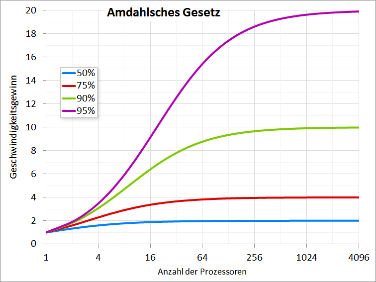

---
title: "Skalierbare Systeme - Grundlagen Systemdesign"
topic: "scalable_systems_1_1"
author: "Silas Schnurr"
theme: "metropolis"
fonttheme: "structurebold"
fontsize: 12pt
urlcolor: BrickRed
linkcolor: BrickRed
aspectratio: 169
lang: de-DE
numbersections: true
plantuml-format: svg
toc: true
section-titles: true
...

# Organisatorisches

## Vorstellung: Silas Schnurr

- Per Du
- E-Mail-Adresse: [schnurr.silas@edu.dhbw-karlsruhe.de](mailto:schnurr.silas@edu.dhbw-karlsruhe.de)
- Seit 2025 IT-Berater/Lead Developer bei PTA IT-Beratung
- 2015 - 2025 bei PeakAvenue in Bühl
  - 2023 - 2025: Softwarearchitekt & Teamleiter Softwareentwicklung
  - 2021 - 2023: _M.Sc._ Informatik - HKA
  - 2018 - 2021: _B.Sc._ Informatik - DHBW Karlsruhe
  - 2015 - 2018: Ausbildung Fachinformatiker Anwendungsentwicklung

## Ablauf

- 7 Termine, insgesamt 26 Vorlesungseinheiten (VE)
  - Sechs Themenblöcke mit je 4 VE, im Wechsel von Silas und Lukas
  - Abschluss: Wiederholung & Klausurvorbereitung (2 VE)
- Freitags 8:30 bis 11:45 Uhr mit 15 Minuten Pause
  - Wöchentlich vom 02.10.2026 bis 06.11.2026
  - Termin 7 ein bis zwei Wochen vor der Klausur online (Klausurtermin?)
- Vorlesung mit durchgespielten Beispielen und Diskussion

## Material

- Vorlesungsfolien \rightarrow{} Slides
- Vorlesungsnotizen \rightarrow{} Notes
- Alles auf GitHub: [dhbw-ka-scalable-systems/lecture](https://github.com/dhbw-ka-scalable-systems/lecture)
  - Fertige PDFs unter Releases
  - Fehler in den Folien? \rightarrow{} PR
  - Auch verlinkt in Moodle

## Prüfungsleistung

- Klausur am Ende des Semesters
  - 50% Verständnisfragen Multiple Choice (x aus n)
  - 50% Anwendungsaufgaben: ein System entwerfen, Trade-offs begründen
- Details in der letzten Vorlesung (Klausurvorbereitung)
- Erlaubte Hilfsmittel: 1 handgeschriebenes DIN A4 Blatt (2 Seiten) mit beliebigem Inhalt

## Erwartungen & Wünsche an die Vorlesung

## Ziele der Vorlesung

- Verstehen, wie aus „funktionierendem Code“ zuverlässige Systeme werden
- Ganzheitliche Betrachtung von Softwaresystemen
- Wie werden reale Systeme robust, sicher und skalierbar gestaltet?
- Nachvollziehen (und treffen) technischer Entscheidungen unter Berücksichtigung verschiedener Stakeholder und Umgebungen

## Vorlesungsinhalte

1. 02.10.2026 Grundlagen Systemdesign _(Silas)_
2. 09.10.2026 Datenarchitektur, Mandantenfähigkeit & Security _(Lukas)_
3. 16.10.2026 Technische Entscheidungsfindung: Trade-offs, Stakeholder & Kontext _(Silas)_
4. 23.10.2026 Resilienz, Fehlertoleranz & Hochverfügbarkeit _(Lukas)_
5. 30.10.2026 Architekturstile _(Silas)_
6. 06.11.2026 Betrieb, Observability & Deployment _(Lukas)_
7. Vor der Klausur: Wiederholung und Klausurvorbereitung _(2 VE, beide)_

## Literatur

- Mark Richards, Neal Ford: _Fundamentals of Software Architecture: An Engineering Approach_. O'Reilly, 2020
- Martin Fowler: _Patterns of Enterprise Application Architecture_. Addison-Wesley, 2013 (19. Druck)
- Neal Ford et al.: _Software Architecture: The Hard Parts: Modern Trade-off Analyses for Distributed Architectures_. O'Reilly, 2021

## Grundregeln

- Es gibt keine "richtige" Architektur, nur eine passende für einen Kontext
- Die Begründung von Entscheidungen ist wichtiger als die Entscheidung selbst
- Entscheidungen sind Kompromisse

# Skalierbare Systeme

## Definition System

Wikipedia:

> Als System wird etwas bezeichnet, dessen Struktur aus verschiedenen Komponenten mit unterschiedlichen Eigenschaften besteht, die aufgrund bestimmter geordneter und funktionaler Beziehungen untereinander als gemeinsames Ganzes betrachtet werden (können) und so von Anderem abgrenzbar sind.

## Definition Softwaresystem

Wikipedia:

> Ein Softwaresystem ist eine Verbindung von miteinander kommunizierenden Komponenten (Bausteinen) auf Softwarebasis, die das Zusammenwirken von Teilen eines Computersystems (eine Kombination aus Hardware und Software) ermöglichen.

## Definition Skalierbarkeit

Wikipedia:

> Unter Skalierbarkeit versteht man die Fähigkeit eines Systems, Netzwerks oder Prozesses zur Größenveränderung. Meist wird dabei die Fähigkeit des Systems zum Wachstum bezeichnet.

## Skalierbarkeit

- Ein System ist skalierbar, wenn es wachsende Last bewältigt, ohne dass Performance oder Kosten unverhältnismäßig leiden
- Keine Ja/Nein-Eigenschaft: "Wenn das System so wächst, welche Optionen haben wir?" (Kleppmann)
- Wachstum in mehreren Dimensionen
  - Last: Requests, gleichzeitige Nutzer
  - Daten: Volumen, Anzahl Datensätze
  - Geografie: Nutzer auf mehreren Kontinenten
  - Organisation: mehr Teams am selben System

## Abgrenzung

- Performance: Wie schnell ist das System bei gegebener Last?
- Elastizität: Wie schnell passt sich das System an schwankende Last an, auch nach unten?
- Effizienz: Wie viele Ressourcen (CPU, Speicher, Server, Geld) verbraucht eine Einheit Arbeit, z. B. ein Request?
  - Zwei gleich schnelle Systeme, eines braucht doppelt so viele Server \rightarrow{} gleiche Performance, halbe Effizienz
- Faustregel
  - Performance-Problem: schon für einen einzelnen Nutzer langsam
  - Skalierungsproblem: schnell für einen Nutzer, langsam unter Last

## Last beschreiben

- Last wird durch Lastparameter beschrieben, welche das sind, hängt vom System ab
  - Webshop: Requests pro Sekunde, gleichzeitige Nutzer
  - Chat: offene Verbindungen, Nachrichten pro Sekunde
  - Reporting: Datenvolumen, Verhältnis von Lese- zu Schreibzugriffen
- Lastprofil: Wie verteilt sich die Last über die Zeit?
  - Tag/Nacht, Black Friday, Monatsabschluss, virale Ereignisse
- Ausgelegt wird auf die Spitze, nicht auf den Durchschnitt

## Performance messen

- Durchsatz: Wie viele Requests pro Sekunde schafft das System?
- Antwortzeit: Was der Client erlebt, vom Absenden bis zur Antwort
- Latenz: Wie lange ein Request wartet, bevor er bearbeitet wird (Netz, Queue)
- Antwortzeit ist keine Zahl, sondern eine Verteilung
- Perzentile statt Mittelwert
  - p50 (Median): Die Hälfte der Requests ist schneller
  - p99: 1 von 100 Requests ist langsamer

## Warum p99 zählt

- 99 % der Requests brauchen 80 ms, 1 % braucht 2 s \rightarrow{} Mittelwert rund 100 ms, sieht gut aus
- 1 % klingt wenig: Bei 1 Mio. Requests am Tag sind das 10.000 langsame
- Fan-out verstärkt Ausreißer: Ruft eine Seite 100 Backends auf, wartet sie in rund 63 % der Aufrufe auf mindestens einen p99-Ausreißer
- Langsame Requests kommen oft von den wichtigsten Kunden: viele Daten, viele Bestellungen

## Skalierbarkeit ist ein Qualitätsattribut von vielen

- Zuverlässigkeit, Wartbarkeit, Sicherheit, Kosten, Time-to-Market
- Skalierbarkeit kostet: Komplexität, Betrieb, Geld
- Vorzeitige Skalierung ist ein Fehler, fehlende Skalierungsoptionen auch
- Ziel der Vorlesung: bewusst entscheiden, nicht maximal skalieren

## Vertikal vs. horizontal skalieren

- Vertikale Skalierung (scale up): größere Maschine; einfach, begrenzt, teuer am oberen Ende
- Horizontale Skalierung (scale out): mehr Maschinen; nahezu unbegrenzt, erfordert Verteilung
- Shared-nothing-Architektur für Scale-out
- In der Praxis: Mischformen (on prem <-> Cloud)

## Shared-nothing-Architektur

- Jeder Knoten hat eigene CPU, eigenen Speicher, eigene Platte
- Knoten teilen nichts und kommunizieren nur über das Netzwerk
- Gegenmodelle: Shared Memory (eine große Maschine), Shared Disk (mehrere Rechner an einem gemeinsamen Speichersystem)
- Vorteil: Knoten lassen sich unabhängig hinzufügen und entfernen, ein Ausfall bleibt lokal
- Nachteile: Daten müssen verteilt werden (Replikation, Partitionierung, Vertiefung in Vorlesung 2), das Netzwerk ist langsam und unzuverlässig (Vertiefung in Vorlesung 4)
- Für Anwendungsserver heißt das: zustandslos bauen, Zustand liegt woanders

## Skalierung früher und heute

- Früher: eigene Hardware, Beschaffung dauert Wochen bis Monate
  - Skalieren hieß meist: Server aufrüsten
- Cloud (AWS, Azure, GCP): neue Instanz in Minuten, Abrechnung nach Nutzung
  - Load Balancer, Datenbanken, Queues als Managed Service
  - Autoscaling und Container machen Scale-out zum Standard
- Aber: Auch vertikal geht heute weiter als früher, einzelne Instanzen mit Hunderten Kernen und TB RAM

- Scale-out ist billiger geworden, aber nicht kostenlos: Verteilung bringt Komplexität

## Grenzen der Skalierung

- Amdahlsches Gesetz: der serielle Anteil begrenzt den Speedup
- Universal Scalability Law: Ab einer bestimmten Größe sinkt der Durchsatz durch mehr Knoten sogar
- Koordination ist der Feind: Locks, verteilte Transaktionen, Konsens
- Faustregel: Skalierung funktioniert gut, wo Arbeit unabhängig ist

## Amdahlsches Gesetz

{height=65%}

Von Frank Klemm, [_CC BY-SA 4.0_](https://creativecommons.org/licenses/by-sa/4.0/), [Wikimedia Commons](https://commons.wikimedia.org/w/index.php?curid=58073217)

## Universal Scalability Law (Gunther)

- Contention (Konkurrenz): Knoten warten auf eine gemeinsame Ressource
  - Auf der Baustelle: ein Kran für alle, mehr Arbeiter stehen sich im Weg
- Coherency (Kohärenz): Knoten müssen ihren Zustand untereinander abgleichen
  - Jeder mit jedem: Der Aufwand wächst quadratisch mit der Anzahl Knoten
  - Folge: Ab einem Punkt kostet jeder weitere Knoten mehr, als er bringt
- Alltag: Ein Team mit 30 Leuten kann langsamer als eines mit 10 sein

## Zustand als Herausforderung

- Zustandslose Komponenten lassen sich beliebig replizieren
- Zustand muss irgendwo liegen: Datenbank, Cache, Session Store, Queue
- Shared nothing verschiebt das Problem nur: Der Zustandsspeicher wird zum geteilten Engpass
- Session-State-Muster nach Fowler: Client, Server und Database Session State
- Muster: Zustand nach außen verlagern, Zustand partitionieren

# Systemdesign als Methode

## Vorgehen (exemplarisch)

1. Anforderungen klären: funktional und nicht-funktional, Lastannahmen
2. Überschlagsrechnung: Last, Speicher, Bandbreite, Kosten
3. High-Level Design: Komponenten und Datenfluss
4. Vertiefung: Engpässe, Datenmodell, Skalierungspfade
5. Trade-offs benennen: Was haben wir bewusst nicht gemacht?

\rightarrow{} Kein Wasserfall: Erkenntnisse aus Schritt 4 ändern oft die Annahmen aus Schritt 1

## Latenzen, die man kennen sollte

| Operation                                | Dauer (Größenordnung) |
|------------------------------------------|----------------------:|
| L1-Cache-Zugriff                         |                  1 ns |
| RAM-Zugriff                              |                100 ns |
| 1 MB sequenziell aus dem RAM lesen       |                  3 µs |
| Zufälliger Lesezugriff auf eine SSD      |            10--100 µs |
| Roundtrip im selben Rechenzentrum        |                0,5 ms |
| Roundtrip Europa -- US-Westküste         |                150 ms |

\rightarrow{} Ein Netzwerkaufruf kostet so viel wie tausende Speicherzugriffe

Nach Jeff Dean und [Colin Scott](https://colin-scott.github.io/personal_website/research/interactive_latency.html), gerundet

## Faustregeln für die Überschlagsrechnung

- Ein Tag hat 86.400 Sekunden, zum Rechnen reichen 100.000
- 1 Mio. Nutzer mit 10 Aktionen pro Tag sind rund 115 Requests pro Sekunde
  - Spitze statt Durchschnitt: Faktor 2 bis 10 einplanen
- Speicher = Anzahl × Größe × Aufbewahrungsdauer
  - 1 Mio. Datensätze à 1 KB pro Tag sind rund 365 GB pro Jahr
- Kosten: Preisrechner der Cloud-Anbieter (AWS, Azure, GCP)
- Verfügbarkeit: 99 % sind 3,65 Tage Ausfall pro Jahr, 99,9 % noch 8,8 Stunden (Vertiefung in Vorlesung 4)

## Vom Design zum Code

- Viele Entscheidungen müssen vor der ersten Zeile Code fallen
  - Kommunikation: REST, gRPC, asynchron über Queues?
  - API-Vorgaben: Limits, Paging, grundsätzlicher Aufbau der Payloads
- Manche Technologien sind gesetzt (Firma, Kunde, Betrieb), andere offen
- Was das Design voraussetzt, muss im Code eingehalten werden: zustandslos, idempotent, Paging statt "alles laden"
- Das muss vorgegeben und geprüft werden: Konventionen, Reviews, Tests, Linter
- Mit KI-Agenten noch wichtiger: Sie kennen nur, was im Kontext steht

# Systemdesign Bausteine

## Wozu dieser Überblick?

- Werkzeugkasten für den Rest der Vorlesung
- Jeder Baustein löst ein Problem und bringt neue mit
- Viele Themen werden heute nur angerissen und später vertieft
- Bis zur nächsten Vorlesung: die Bausteine passiv kennen
  - Tipp: direkt auf das A4-Blatt für die Klausur schreiben
- Empfehlung zum Wiederholen: NeetCode, [_20 System Design Concepts Explained in 10 Minutes_](https://www.youtube.com/watch?v=i53Gi_K3o7I)

## Systemdesign, Softwarearchitektur, Softwaredesign

- Systemdesign: Welche Bausteine (Server, Datenbanken, Caches, Queues) arbeiten zur Laufzeit wie zusammen?
- Softwarearchitektur: grundlegende Struktur, Stile, Schnitt in Komponenten, Entscheidungen und ihre Begründung (Grundlagen dazu in Vorlesung 3 und 5)
- Softwaredesign: Klassen, Schnittstellen und Muster im Code, beschrieben z. B. mit UML
- Die Grenzen sind fließend
- Gemeinsam: Qualitätsattribute wie Skalierbarkeit entstehen auf allen drei Ebenen

## Hinweis zu den folgenden Folien

- Die Übersicht ist bewusst nicht vollständig
  - nicht alle Bausteine, nicht alle Einsatzzwecke, nicht alle Vor- und Nachteile, nicht alle Alternativen
- Hilfe um zu verstehen, welches Problem ein Baustein löst und welches er neu schafft

# Systemdesign: Grundlagen & Skalierung

## Load Balancer

- **Problem:** Eine einzelne Instanz ist Engpass für die Last und Single Point of Failure
- **Lösung:** verteilt eingehende Anfragen auf mehrere Instanzen und nimmt defekte per Health Check aus der Rotation
- **Nachteile:** zusätzlicher Hop, selbst ein Single Point of Failure und muss redundant sein (Vertiefung in Vorlesung 4)
- **Alternativen:** Verteilung über DNS, clientseitiges Load Balancing über Service Discovery
- **Beispiele:** nginx, HAProxy, AWS ELB, Azure Load Balancer

<!-- Bei Nachfrage: Layer 4 (TCP, schnell, sieht keine Inhalte) vs. Layer 7 (HTTP, Routing nach Pfad, Header, Cookie). Algorithmen: Round Robin, Least Connections, gewichtet, Hash auf Client oder Schlüssel. -->

## Content Delivery Network (CDN)

- **Problem:** Nutzer weit weg vom Server warten lange, und jeder Abruf belastet den Ursprungsserver
- **Lösung:** verteilte Cache-Server nah am Nutzer (Edge), die statt des Ursprungsservers (Origin) ausliefern, vor allem Bilder, JavaScript und Videos
- Fängt nebenbei DDoS-Angriffe ab
- Heute auch API-Antworten an der Edge cachen und Code dort ausführen (Edge Functions)
- **Nachteile:** Invalidierung über viele Standorte, Kosten nach Traffic, Abhängigkeit vom Anbieter
- **Alternativen:** eigener Reverse-Proxy-Cache, Server in mehreren Regionen
- **Beispiele:** Cloudflare, Akamai, AWS CloudFront, Azure Front Door

## Caching

- **Problem:** Dieselben Daten werden immer wieder teuer berechnet oder geladen, z. B. Produktseiten oder Ergebnisse von Abfragen
- **Lösung:** Kopie von Daten an einem schnelleren oder näheren Ort; lohnt sich für Daten, die oft gelesen und selten geändert werden
- **Ebenen:** Browser, CDN / Reverse Proxy, Anwendung (In-Memory oder Redis), Datenbank
- **Kennzahl:** Trefferquote (Hit Rate)
- **Nachteile:** Daten können veraltet sein, zusätzlicher Speicher und Betrieb, Fehler schwer nachzuvollziehen
- **Alternativen:** schnellere Abfrage (Index), Read Replicas, Ergebnisse vorberechnen
- **Beispiele:** Redis, Memcached

# Systemdesign: Kommunikation

## IP, TCP und UDP (Wiederholung)

- IP: adressiert Rechner und transportiert Pakete, ohne Garantie
- TCP: Verbindung mit garantierter, geordneter Zustellung
  - Nachteile: Verbindungsaufbau kostet einen Roundtrip, ein verlorenes Paket hält alle folgenden auf
- UDP: ohne Verbindung und Garantie, dafür schnell: Video, Spiele, DNS, HTTP/3
- Für das Systemdesign: Verbindungen wiederverwenden (Keep-Alive, Connection Pooling)

## Domain Name System (DNS)

- **Problem:** Menschen und Programme brauchen stabile Namen, IP-Adressen ändern sich
- **Lösung:** übersetzt Namen in IP-Adressen, hierarchisch und verteilt
- **Einsatz im Systemdesign:** einfache Lastverteilung über mehrere Adressen, Failover, Nutzer zur nächsten Region leiten (GeoDNS)
- **Nachteile:** Antworten werden nach TTL gecacht, Änderungen wirken verzögert, Clients halten sich nicht immer an die TTL
- DNS ist eine kritische Abhängigkeit: Der Ausfall von Dyn 2016 legte Twitter, GitHub und Netflix lahm
- **Alternativen:** Anycast, Service Discovery innerhalb des Rechenzentrums

## HTTP (Wiederholung)

- Request/Response und zustandslos: Grundlage für horizontale Skalierung
- Methoden mit Semantik: GET ist sicher, GET, PUT und DELETE sind idempotent, POST nicht (Bezug Vorlesung 4)
- Caching ist eingebaut: `Cache-Control`, `ETag`; CDN und Proxys cachen mit
- Statuscodes als Vertrag: `429 Too Many Requests`, `503 Service Unavailable`, `Retry-After`
- Versionen: HTTP/1.1, HTTP/2 (mehrere Anfragen über eine Verbindung), HTTP/3 (QUIC über UDP)

## TLS / HTTPS & Data-in-Transit Encryption

- **Problem:** Unterwegs im Netz kann mitgelesen und verändert werden
- **Lösung:** verschlüsselt die Verbindung und weist die Identität des Servers über Zertifikate nach; Standard für jede Verbindung nach außen
- **Nachteile:** Handshake kostet Roundtrips und CPU (mit TLS 1.3 gering), Zertifikate verwalten und erneuern
- Wo endet TLS? Am Load Balancer (TLS Termination) oder erst im Service (Ende-zu-Ende, mTLS zwischen Services)
- Vertiefung in Vorlesung 2

# Systemdesign: APIs & Service-Architektur

## REST

- **Problem:** Clients und Server verschiedener Teams und Firmen müssen einheitlich miteinander reden
- **Lösung:** Ressourcen über URLs, Standardmethoden von HTTP, zustandslos; Standard für öffentliche APIs und Web-Backends
- **Vorteile:** einfach, überall unterstützt, HTTP-Caching nutzbar
- **Nachteile:** Over- und Underfetching, viele Requests für eine Ansicht, Schema nur optional (OpenAPI)
- Vorab festlegen: Paging, Versionierung, Fehlerformat, Limits
- **Alternativen:** GraphQL, gRPC

## GraphQL

- **Problem:** Verschiedene Clients (Web, App) brauchen verschiedene, oft verschachtelte Daten; eine feste API liefert zu viel oder zu wenig
- **Lösung:** Client beschreibt in einer Query genau die Daten, die er braucht; ein Endpunkt
- **Vorteile:** kein Over- und Underfetching, typisiertes Schema
- **Nachteile:** HTTP-Caching kaum nutzbar, teure Queries möglich und müssen begrenzt werden, N+1-Abfragen im Server
- **Alternativen:** REST mit einem Backend for Frontend, gRPC

## gRPC

- **Problem:** Interne Services rufen sich millionenfach auf, JSON als Text ist groß, langsam und ohne festen Vertrag
- **Lösung:** Remote Procedure Calls über HTTP/2 mit Protocol Buffers (binär, mit Schema), auch als Stream
- **Vorteile:** kompakt und schnell, Code-Generierung aus dem Schema, typsicher
- **Nachteile:** im Browser nur über Umweg (gRPC-Web), Nachrichten nicht direkt lesbar
- **Alternativen:** REST mit JSON, Messaging

## WebSockets

- **Problem:** Chat, Live-Updates oder Spiele brauchen Nachrichten vom Server, bei HTTP fragt aber nur der Client
- **Lösung:** dauerhafte, bidirektionale Verbindung zwischen Client und Server
- **Nachteile:** Jede Verbindung ist Zustand auf einem Server \rightarrow{} Load Balancing und Scale-out schwieriger
- Verbindungsabbrüche und Wiederverbinden müssen behandelt werden
- **Alternativen:** Polling, Long Polling, Server-Sent Events (nur Server zu Client)

## API Gateway & Reverse Proxy

- **Problem:** Jeder Service müsste TLS, Authentifizierung und Limits selbst umsetzen, und Clients müssten alle Adressen kennen
- Reverse Proxy: steht vor den Servern und leitet Anfragen weiter; TLS, Caching, Kompression
- API Gateway: Reverse Proxy mit API-Funktionen: Authentifizierung, Rate Limiting, Routing auf Services
- **Nachteile:** zusätzlicher Hop, zentraler Engpass, Gefahr, dass Fachlogik ins Gateway wandert
- **Alternativen:** Querschnittsthemen in jedem Service (Bibliothek), Service Mesh
- **Beispiele:** nginx, Kong, AWS API Gateway, Azure API Management

## Rate Limiting & Throttling

- **Problem:** Ein einzelner Client, ob fehlerhaft oder böswillig, kann das System für alle überlasten
- **Lösung:** begrenzt Anfragen pro Client und Zeitfenster, Antwort `429 Too Many Requests`
- **Einsatz:** öffentliche APIs, Login gegen Passwort-Raten, faire Verteilung zwischen Mandanten (Bezug Vorlesung 2)
- Throttling: Anfragen verlangsamen oder einreihen statt ablehnen
- **Nachteile:** Zähler muss über alle Instanzen geteilt werden (z. B. Redis), legitime Spitzen werden abgelehnt
- Vertiefung in Vorlesung 4

<!-- Bei Nachfrage: Algorithmen Fixed Window, Sliding Window, Token Bucket. -->

## Monolith vs. Microservices

- Monolith: eine deploybare Einheit, meist eine Datenbank
  - einfach zu entwickeln, testen und betreiben; skaliert nur als Ganzes
- Microservices: viele kleine, unabhängig deploybare Services mit eigenen Daten
  - einzeln skalierbar und deploybar, aber ein verteiltes System mit allen Kosten
- Dazwischen: modularer Monolith (Modulith), service-basierte Architektur
- Faustregel: Monolith wenn möglich, aufteilen, wenn nötig
- Vertiefung in Vorlesung 5

# Systemdesign: Persistenz

## SQL

- **Problem:** Strukturierte Daten mit Beziehungen sollen dauerhaft, konsistent und flexibel abfragbar gespeichert werden
- **Lösung:** relationale Datenbank: Tabellen mit festem Schema, Beziehungen über Schlüssel, Abfragen mit SQL
- **Vorteile:** ACID, ausgereift, Joins, Constraints sichern Konsistenz
- **Nachteile:** Schemaänderungen aufwendig, Schreiblast schwer über eine Maschine hinaus zu skalieren
- **Beispiele:** PostgreSQL, MySQL, SQL Server, Oracle
- die Standardwahl, solange nichts dagegen spricht (Mehr in Vorlesung 2)

## ACID

- **A**tomicity: ganz oder gar nicht
- **C**onsistency: Constraints und Invarianten bleiben gültig
- **I**solation: parallele Transaktionen stören sich nicht, je nach Isolationslevel
- **D**urability: bestätigt heißt gespeichert, auch nach einem Absturz
- **Nachteile:** Koordination und Locks (Bezug Universal Scalability Law)
- Über mehrere Knoten deutlich teurer (Vertiefung in Vorlesung 2)

## NoSQL

- **Problem:** Manche Daten passen schlecht in Tabellen, oder die Last übersteigt, was eine relationale Datenbank schafft
- Sammelbegriff für nicht-relationale Datenbanken (Vertiefung in Vorlesung 2)
- **Vorteile:** oft für Scale-out gebaut, flexibles Schema
- **Nachteile:** weniger Abfragemöglichkeiten, Joins und Transaktionen eingeschränkt, Datenmodell folgt den Zugriffen

## Object / Blob Storage

- **Problem:** Große Dateien wie Bilder, Videos, Backups oder Logs gehören weder in die Datenbank noch auf die Platte eines einzelnen Servers
- **Lösung:** Dateien als Objekte mit Schlüssel und Metadaten, Zugriff über eine HTTP-API
- **Vorteile:** praktisch unbegrenzt, günstig, hoch verfügbar
- **Nachteile:** keine Abfragen, keine Teiländerungen, höhere Latenz als ein lokales Dateisystem
- Muster: Datei in den Object Storage, Verweis in die Datenbank, Auslieferung über CDN oder signierte URLs
- **Alternativen:** Netzwerk-Dateisystem, Blobs in der Datenbank (selten sinnvoll)
- **Beispiele:** AWS S3, Azure Blob Storage, MinIO

## Search Engines

- **Beispielproblem:** Eine Produktsuche mit `LIKE '%...%'` in der Datenbank ist langsam und findet weder Tippfehler noch ähnliche Bedeutungen
- Suchmaschine: invertierter Index für Volltextsuche, Relevanz, Facetten, Tippfehlertoleranz
- **Nachteile:** zweite Datenhaltung, der Index hinkt hinterher, eigener Betrieb
- **Alternativen:** Volltextsuche in PostgreSQL oder SQL Server
- **Beispiele:** Elasticsearch, OpenSearch, Solr

# Systemdesign: Asynchrone Kommunikation & Datenverarbeitung

## Synchron vs. asynchron

- Synchron: Der Aufrufer wartet auf die Antwort (HTTP, gRPC)
  - einfach zu verstehen, aber zeitlich gekoppelt: Ist der Aufgerufene langsam oder weg, leidet der Aufrufer mit
- Asynchron: Der Aufrufer legt eine Nachricht ab und arbeitet weiter
  - zeitlich entkoppelt, aber das Ergebnis kommt später, Fehler sind schwerer nachzuvollziehen
- Faustregel: synchron, wenn die Antwort sofort gebraucht wird, sonst asynchron
- Kopplung und Kohäsion allgemein: Vertiefung in Vorlesung 5

## Message Queues

- **Problem:** Langsame Arbeit im Request (E-Mails, Bildverarbeitung) lässt den Nutzer warten, und Lastspitzen treffen das System ungebremst
- **Lösung:** Puffer zwischen Produzent und Konsument, jede Nachricht verarbeitet genau ein Worker; beide Seiten skalieren unabhängig
- Backpressure: Was passiert, wenn Produzenten schneller sind als Konsumenten?
- Zustellung meist at-least-once \rightarrow{} Konsumenten müssen idempotent sein
- **Nachteile:** Eventual Consistency (Vorlesung 2), schwerer nachzuvollziehen, Umgang mit fehlerhaften Nachrichten (Dead Letter Queue)
- **Beispiele:** RabbitMQ, AWS SQS, Azure Service Bus

## Event Streaming (Kafka vs. Queues)

- **Problem:** Aus einer Queue ist eine Nachricht nach der Verarbeitung weg, neue Konsumenten und Korrekturen brauchen aber die Historie
- Queue: Nachricht wird nach der Verarbeitung gelöscht
- Log: Ereignisse werden dauerhaft und geordnet gespeichert, jeder Konsument merkt sich seine Position (Offset)
- Damit möglich: Ereignisse erneut abspielen, viele unabhängige Konsumenten, Reihenfolge pro Partition
- **Einsatz:** Datenpipelines, Event Sourcing, Integration vieler Systeme, Analytics
- **Nachteile:** aufwendiger Betrieb, Partitionierung planen, Reihenfolge nur innerhalb einer Partition
- **Beispiele:** Apache Kafka, AWS Kinesis, Azure Event Hubs

## Batch vs. Stream Processing

- Batch: große Datenmenge auf einmal verarbeiten, z. B. nächtlich
  - einfach, effizient, wiederholbar, aber Ergebnisse erst nach Stunden
- Stream: jedes Ereignis verarbeiten, sobald es eintrifft
  - Ergebnisse in Sekunden, aber komplex: verspätete und doppelte Ereignisse, Zustand
- **Beispiele:** Abrechnung und Reports (Batch) vs. Betrugserkennung und Live-Dashboards (Stream)
- **Werkzeuge:** Spark (Batch), Flink und Kafka Streams (Stream)

## Wie es weitergeht

- Vorlesung 2: Datenarchitektur, Mandantenfähigkeit & Security _(Lukas)_
- Vorlesung 3: Technische Entscheidungsfindung: Trade-offs, Stakeholder & Kontext _(Silas)_
- Vorlesung 4: Resilienz, Fehlertoleranz & Hochverfügbarkeit _(Lukas)_
- Vorlesung 5: Architekturstile _(Silas)_
- Vorlesung 6: Betrieb, Observability & Deployment _(Lukas)_
