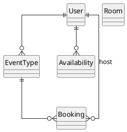
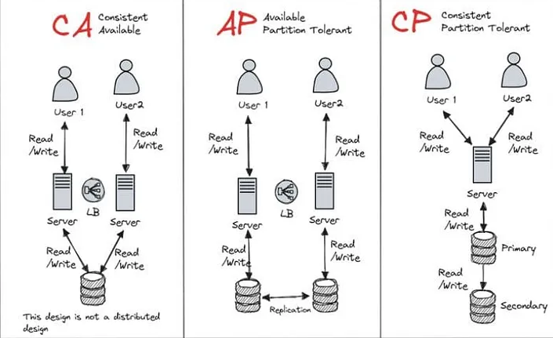
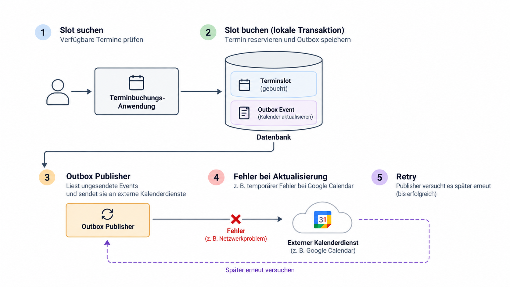
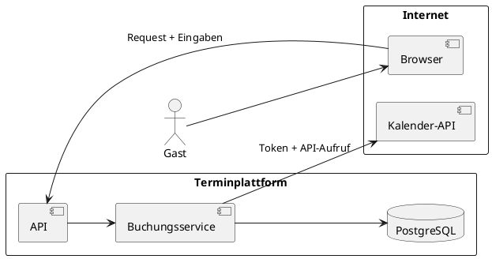

---
title: "Skalierbare Systeme - Datenarchitektur, Mandantenfähigkeit & System-Security"
topic: "scalable_systems_1_2"
author: "Lukas Panni"
theme: "metropolis"
fonttheme: "structurebold"
fontsize: 12pt
urlcolor: BrickRed
linkcolor: BrickRed
aspectratio: 169
lang: de-DE
numbersections: true
plantuml-format: svg
toc: true
section-titles: true
...

<!--
Time plan: 4 VE = 180 min content, Friday 8:30-11:45 with a 15 min break on top.
  Organisatorisches (Heute, Vorstellung)   8
  Lernziele                                2
  Datenarchitektur                        50   8 slides
  Mandantenfähigkeit                      40   worked example ~15
  System-Security                         40   6 slides
  AI Engineering                          15
  Zusammenfassung                          5
  Sum                                    160   20 min slack
-->

# Organisatorisches

## Heute

- Datenarchitektur: Datenmodell, Transaktionen, Replikation und Partitionierung
- Mandantenfähigkeit: Isolation ist eine Architekturentscheidung
- System-Security: Grenzen, Identitäten und Schutzschichten
- Durchgängiges Beispiel: Cal.diy, erweitert zum Mandanten-Teaching-Model
- AI Engineering: Daten und Sicherheit für KI-Systeme

## Vorstellung

### Dozent: Lukas Panni

<!-- TODO(Lu): bio and e-mail address -->

- Per Du
- E-Mail-Adresse: <lukas.panni@outlook.de>
- Seit 2018 bei SEW-EURODRIVE in Bruchsal
  - 2023: _M.Sc._ Informatik - HKA
  - 2021: _B.Sc._ Informatik - DHBW Karlsruhe

## Lernziele

- Datenmodell und Zugriffswege gemeinsam entwerfen
- Replikation, Partitionierung und Konsistenz passend einordnen
- drei grundlegende Mandantenmodelle vergleichen
- Tenant-Isolation über den ganzen Request erzwingen
- Bedrohungen an Vertrauensgrenzen finden und Schutzmaßnahmen ableiten

## Unser reales Beispiel: Cal.com/Cal.diy

- Community-getriebene, Open-Source Next.js basierte Terminplanungsplattform: [github.com/calcom/cal.diy](https://github.com/calcom/cal.diy)
- Selbst gehostete Community-Edition von [Cal.com](https://cal.com)
- Terminarten, Verfügbarkeiten und Buchungen
- Integrationen mit externen Kalendern und Videodiensten

# Datenarchitektur

## Datenarchitektur - Grundlagen (1)

Wikipedia:

> Datenarchitektur ist eine Teildisziplin der IT-Architektur, die sich mit grundlegenden Strukturen und Prinzipien zu Daten und Informationen, ihrer Konstruktion, Nutzung und Weiterentwicklung befasst.

## Datenarchitektur - Grundlagen (2)

- Welche Daten gibt es, wie sind die Beziehungen zwischen ihnen?
- Wem gehören die Daten, wer steuert den Zugriff?
- Wer liest und schreibt wann, wie oft und mit welchen weiteren Anforderungen?
- Wo werden Daten gespeichert, wie lange und mit welchen Anforderungen an Verfügbarkeit und Konsistenz?

## Vom Anwendungsfall zum Datenmodell - Use-Case Terminbuchung (1)

1. Gast öffnet eine Buchungsseite
2. System zeigt freie Zeiten
3. Gast wählt einen Zeitslot
4. System legt eine Buchung an
5. Externer Kalender wird aktualisiert (z.B. via Webhook)
6. Bestätigung wird versendet

## Vom Anwendungsfall zum Datenmodell - Use-Case Terminbuchung (2)

- Welche Informationen werden benötigt?
- Wer greift zu? lesend? schreibend?
- Zugriffshäufigkeiten?
- Anforderungen an Konsistenz? Transaktionen?

## Datenmodell: drei Ebenen

1. **Konzeptuell:** Modellierung der Realität. Daten und ihre Beziehungen.
2. **Logisch:** Wie bildet das gewählte DBMS diese Dinge ab?
3. **Physisch:** Wie werden sie technisch gespeichert und schnell erreichbar gemacht?

Entspricht strukturiertem Vorgehen: erst Daten erfassen + modellieren, dann Entscheidung für Datenbanksystem treffen, dann technische Details festlegen.

## Konzeptuelles Datenmodell: Cal.diy



## Logisches Datenmodell: relational

- Relational: Daten liegen in **Relationen** (Tabellen)
- Jede Relation ist eine Menge von **Tupeln** (Datensätzen) desselben Typs
- Beziehungen werden etwa über Fremdschlüssel abgebildet; Constraints machen Regeln prüfbar
- Für Buchungen mit Beziehungen und Transaktionen ist das ein guter Start

## Logische Datenmodelle: weitere Optionen "NoSQL"

- **Dokumentenorientiert**: zusammengehörige Daten als Dokument; flexibel, gut für Aggregate
- **Key-Value Store:** Schlüssel führt direkt zu einem Wert; gut für Cache oder Sessions
- **Graphdatenbank:** Knoten und Kanten, gut für viele Beziehungsabfragen
- **Objektorientierte Datenbank:** persistiert Objekte direkt; heute eher Nische

## Logisches Datenmodell: Auswahl

- Kein perfektes System für alle Anwendungsfälle
- Alle Arten haben Vor- und Nachteile
- Entscheidung sollte von Zugriffsmustern und Domänenregeln abhängen
  - Anforderungen an Konsistenz
  - Zugriffshäufigkeiten
  - Art der Beziehungen
- Für viele Anwendungen ist eine relationale Datenbank ein guter Startpunkt, erweitern bei Bedarf

## Zugriffsmuster im Beispiel

Typische Abfragen:

- Freie Slots einer Terminart anzeigen
- Eine eindeutige Buchung laden
- Buchungen auflisten
- Kollision mit bestehender Buchung prüfen
- Externe Services abfragen oder aktualisieren

## Physisches Datenmodell

- Ergänzt das logische Modell um technische Details der Speicherung und Zugriffsoptimierung
- Beispiele: Indexstrukturen, Partitionierung, Replikation, Speicherformat und Query-Pläne
  - z.B. für schnelle Abfragen auf freie Slots, Constraints für Konsistenz und Einhaltung logischer Regeln
- Datenbanknutzer sehen diese Details meist nicht; die Latenz und Kosten aber schon

## Polyglot Persistence

- Ein System nutzt bewusst mehrere Speichermodelle für verschiedene Aufgaben
  - z.B. wenn ein relationales Modell nicht alle Anforderungen erfüllt
  - Beispiel: PostgreSQL für Buchungen, Key-Value für Sessions, Suchindex für Volltext
- Jedes zusätzliche System kostet Betrieb, Konsistenzarbeit und Wissen
- Deshalb: erst ein passendes System, weitere nur bei messbarem Bedarf

## Wiederholung Transaktionen (1)

> Folge von Operationen, die als logische Einheit betrachtet werden und entweder vollständig ausgeführt oder vollständig zurückgesetzt werden.

## Transaktionen bei Buchungen

1. Slot prüfen
2. Buchung anlegen
3. Status und Teilnehmer speichern

Nicht Teil derselben Datenbanktransaktion:

- externer Kalender
- E-Mail-Versand
- Webhooks

## Wiederholung Transaktionen (2) ACID

- **Atomicity:** ganz oder gar nicht
- **Consistency:** Datenregeln bleiben erfüllt
- **Isolation:** parallele Transaktionen sehen keinen unkontrollierten Zwischenstand
- **Durability:** bestätigte Daten bleiben gespeichert

## Think-Pair-Share: Doppelbuchung

**Arbeitszeit: 6 Minuten — 2 allein, 2 zu zweit, 2 im Plenum**

Zwei Requests prüfen "gleichzeitig" denselben freien Slot und wollen beide buchen.

1. Wo genau ist die Race Condition?
2. Welche Regel muss unabhängig vom Anwendungscode gelten?
3. Was darf bei der zweiten Anfrage passieren?

## Doppelbuchung Ergebnis (1)


## Lösung mit Transaktionen? (1)

Warum lösen Transaktionen das Problem der Doppelbuchung nicht garantiert?

## Lösung mit Transaktionen? (2)

- Beide Requests müssen entweder komplett ausgeführt oder komplett zurückgesetzt werden
- Annahme: Isolation Level Read Committed o. ä.
  - Solange bei Start beider Transaktionen der Slot noch frei ist können beide ohne Verletzung von Konsistenzregeln schreiben!
- Lösungsmöglichkeit: Höheres Isolationslevel, _aber_ Performance kann leiden

## Wiederholung: Isolation Levels

Isolation bestimmt, welche Auswirkungen **parallel laufender Transaktionen** sichtbar werden.

| Level                      | Zusage                                                                                                               |
| -------------------------- | -------------------------------------------------------------------------------------------------------------------- |
| Read Committed             | Transaktion kann nur bestätigte (commitete) Änderungen sehen; zwischen zwei Operationen kann sich der Stand ändern. |
| Repeatable Read / Snapshot | Transaktion sieht nur Änderungen, die vor Start der Transaktion commitet wurden.                                    |
| Serializable               | Transaktionen wirken als wären sie nacheinander ausgeführt worden, keine phantom reads möglich                       |

- Höhere Isolation bedeutet mehr Koordination, mögliche Abbrüche und Retries
- Details und konkrete Namen unterscheiden sich je nach DBMS

## Alternative Lösung: Unique Constraint (1)

- z.B. Unique Index auf `room_id` und `start_time` für bestätigte Buchungen
  - Reicht noch nicht aus für flexible Zeitintervalle, die überlappen können

```sql
-- Für feste Slots, etwa immer 30 Minuten:
CREATE UNIQUE INDEX booking_one_per_fixed_slot
ON booking (room_id, start_time)
WHERE status = 'CONFIRMED';
```

- Beispiel für Teil des physischen Datenmodells, reines Implementierungsdetail

## Alternative Lösung: Unique Constraint (2)


## Warum Konsistenzregeln in der Datenbank?

- Invarianten im Datenmodell (z.B. nur eine bestätigte Buchung pro Raum und Zeit) sollte nah bei den Daten abgesichert werden
  - Regeln die unabhängig vom Use-Case gelten sollen
- Bei Umsetzung in Datenbank:
  - Regeln gelten unabhängig über welchen Weg die Daten geändert werden (parallele Requests, Batch-Jobs, Admin-Tools, neue Code-Pfade ...)
  - Einfach wartbar
  - Schützt vor Inkonsistenzen bei parallelen Anfragen

## Warum Daten verteilen?

Eine einzelne Datenbank kann an Grenzen stoßen:

- Viele gleichzeitige Zugriffe erhöhen Wartezeiten
- Große Datenmengen übersteigen Speicher- oder Rechenkapazität
- Weit entfernte Nutzer warten länger auf Antworten
- Single Point of Failure

## Replikation (1)

> **Replikation**: Dieselben Daten verteilt auf mehrere Server.

- Löst Probleme mit Single Point of Failure und Latenzen
- Keine Lösung für große Datenmengen -> gleiche Daten müssen auf allen Servern vorgehalten werden
- Neues Problem: Konsistenz bei parallelen Schreibzugriffen auf verschiedene Server

## Replikation (2)

- **Starke Konsistenz:** Nach bestätigtem Schreiben liefert eine Leseanfrage den neuen Stand oder schlägt fehl
- **Eventual Consistency:** Eine Leseanfrage kann zunächst noch den alten Stand liefern, später gleichen sich die Kopien an
- **CAP** = Consistency, Availability, Partition Tolerance (ein verteiltes System kann immer nur zwei der drei Eigenschaften gleichzeitig erfüllen)
  - Bei Netzwerkunterbrechung zwischen Konsistenz und Verfügbarkeit wählen

## CAP



> <https://medium.com/@anupchakole/understanding-the-cap-theorem-why-your-system-cant-have-it-all-4004c25e021f>

## BASE

**B**asically **A**vailable, **S**oft State, **E**ventual Consistency

- Alternatives Konsistenzmodell zu ACID in verteilten Systemen
- Hohe Verfügbarkeit, gute Skalierbarkeit
- Tradeoff: geringere Konsistenzgarantien
- In NoSQL-Datenbanken in verteilten Systemen verbreitet

## Replikation Modelle

- **Leader-Follower Modell**
  - Ein Server ist der Leader, alle anderen sind Follower
  - Schreibzugriffe gehen an den Leader, Lesezugriffe sind bei allen möglich
  - Aktualisierungen werden vom Leader an die Follower weitergegeben
    - synchron oder asynchron möglich
    - bei asynchroner Replikation nur eventual consistency
- Anpassung: Multi-Leader
  - Mehrere Leader erlauben parallele Schreibzugriffe
  - Konflikte müssen aufgelöst werden
  - Oder Kombination mit Sharding
- Komplexer: Leaderless mit Quoren

## Partitionierung / Sharding

> **Sharding / Partitionierung**: Die Daten werden auf mehrere Server verteilt, sodass jeder Server nur einen Teil der Daten hält.

- Vorteile
  - Reduziert die Datenmenge pro Server
  - Parallele Schreib- und Lesezugriffe ohne zusätzliche Koordination
  - bei Geografischer Verteilung oft gut: z.B. deutsche User nutzen häufig deutsche Daten, andere weniger häufig

## Sharding Umsetzung

- Shard Key: Alle Daten eines bestimmten Schlüssels liegen auf demselben Shard
  - z.B. user_id -> Daten werden nach User-ID aufgeteilt: gleiche user_id = gleicher Shard
- Zentraler Koordinator / Router mit Kenntnis der Shard-Zuordnung notwendig
  - kann selbst wiederum repliziert sein
- Technische Umsetzung
  - **Range Sharding**: Aufteilung nach Wertebereich
    - Beispiel: user_id 1-1000 auf Shard 1, 1001-2000 auf Shard 2
    - Hotspot Risiko größer
  - **Hash Sharding**: Aufteilung nach Hashwert des Shard Keys
    - Ziel: gleichmäßige Verteilung der Daten auf die Shards
    - Schlecht wenn häufig ganze Wertebereiche abgefragt werden

## Sharding Umsetzung (2)


## Sharding Umsetzung (3)


## Sharding Herausforderungen

- Aufteilung der Daten ist Anwendungsfallabhängig
  - **Ziel**: gleichmäßige Verteilung der Last
  - Last kann sich über Zeit verschieben, Rebalancing notwendig
- Größerer Aufwand bei Cross-Shard-Operationen: z.B. Joins über mehrere Shards, globale Abfragen, Transaktionen
- Abhilfe durch Denormalisierung möglich, aber Aufwand um Konsistenz sicherzustellen

## Verteilte Transaktionen

- Transaktionen zwischen verschiedenen Shards oder verschiedenen Systemen erfordern spezielle Koordination
  - Datenbanksystem selbst kann ACID nicht mehr ohne weiteres garantieren

- **Two-Phase Commit (2PC)**
  - _Phase 1_: Prepare
    - Alle Systeme prüfen, ob sie die Transaktion ausführen können
  - _Phase 2_: Commit
    - Wenn alle Systeme bereit sind, wird die Transaktion ausgeführt
    - Andernfalls wird sie abgebrochen
    - Rollback, wenn ein System die erfolgreiche Ausführung der Transaktion nicht bestätigen kann

## Verteilte Transaktionen (2)

- 2PC Nachteile
  - Koordinator notwendig
  - hohe Latenz, geringer Durchsatz, viel Kommunikationsoverhead
  - Problematisch bei System/Kommunikations-ausfällen
- Bei Aktualisierung von externen Systemen: Outbox Pattern
  - Aktualisierung von internem Anwendungszustand per Transaktion
  - In gleicher Transaktion wird ein Aktualisierungs-Event in der DB gespeichert
  - Events werden nachgelagert an externe Systeme gesendet
  - Idempotenz bei Event-Empfänger notwendig!

## Outbox Pattern Beispiel



## Daten aufteilen? Data Disintegrators

- **Änderungen:** Auswirkungen von Änderungen an Daten auf Services
  - Trennung erleichtert Änderungen an getrennten Services
  - Trennung verringert Koordinationsaufwand über verschiedene Entwicklungs-Teams
  - Klare Datenhoheit wichtig (auch in monolithischen DBs): mehrere Services sollten nicht gleichzeitig die gleichen Daten ändern
- **Betrieb + Skalierung:**
  - Trennung ermöglicht unabhängige Skalierung und Wartung
  - Trennung erleichtert Verbindungsmanagement und Auslastung von Connection Pools
  - Trennung erleichtert Fehlertoleranz für _Teile_ der Anwendung

## Daten zusammenhalten? Data Integrators

- **Beziehungen:**
  - Fremdschlüssel und Constraints sichern Integrität, koppeln aber zusammengehörige Daten
  - Konsistenz wird durch geteilte Daten erschwert
- **Transaktionen:**
  - Gemeinsame ACID-Transaktionen sind über getrennte Datenbanken nicht ohne Weiteres möglich
  - Verteilte Transaktionen bringen Koordination, Latenz und Ausfallrisiken mit sich

# Mandantenfähigkeit

## Ausgangssituation


## Was ist ein Mandant?

- engl. "tenant" -> "Multi-Tenancy"
- organisatorisch abgegrenzte Kundengruppe in einem gemeinsamen Produkt
- eigene Daten, Einstellungen, Benutzer und Berechtigungen

## Multi-Tenancy - Definition + Motivation

> Ein System bedient mehrere Mandanten gleichzeitig, wobei die Daten und Aktionen der Mandanten logisch getrennt bleiben.

- Ökonomischere Ressourcennutzung, spart Betriebskosten
- Zentrale Weiterentwicklung
- Skalierbarer Betrieb

## Von Single-Tenancy zu Multi-Tenancy (1)

- Viele Anwendungen starten nicht mit Multi-Tenancy als Anforderung
  - Siehe Cal.diy Beispiel
  - Was fehlt uns für Multi-Tenancy? (Ziel: Untersützung für mehrere Organisationen)

## Von Single-Tenancy zu Multi-Tenancy (2)

- Anpassungen im Datenmodell: Alle Daten müssen einem Mandanten (einer Organisation) zugeordnet werden
- Anpassungen in der Anwendungslogik:
  - Alle Use-Cases müssen den aktuellen Mandantenkontext berücksichtigen
  - Neue Use-Cases für Mandantenübergreifende Operationen: z.B. Reporting, Administration

## Drei Modelle für Datenisolation

| Modell | Datenablage                      | Isolation |          Betrieb |
| ------ | -------------------------------- | --------: | ---------------: |
| Pool   | gemeinsame Tabellen, `tenant_id` |   logisch |          einfach |
| Bridge | eigenes Schema pro Mandant       |   stärker | mehr Migrationen |
| Silo   | eigene Datenbank oder Instanz    |     stark |        aufwendig |

Kein Modell gewinnt immer: Compliance, Größe, Kosten und Betrieb entscheiden.

## Silo: höchste Isolation, aufwendig im Betrieb

- Einfachste Lösung: jeder Mandant bekommt eine eigene Instanz (Datenbank oder Anwendung)
- Stärkste mögliche Isolation
- Hoher Verwaltungsaufwand für Betrieb und Updates
- Kaum gemeinsame Infrastrukturnutzung, keine Skaleneffekte
- Schlecht für Mandantenübergreifende Operationen: Administration, Observability

## Silo


## Pool: einfach umzusetzen, aber mit Risiken

```text
booking(id, organization_id, host_id, start_time, status)
```

- einfach umzusetzen
- jede relevante Abfrage ist mandantengebunden
- ein vergessener Filter wird zum Datenleck, Fehler haben große Auswirkungen
- gemeinsame Infrastruktur: kostengünstig, Last aber auch geteilt -> _Noisy Neighbours_

## Pool


## Bridge: mittlere Isolation, mittlerer Aufwand

- eigenes Schema pro Mandant, aber gleiche Datenbank(instanz)
- relativ starke technische Trennung auf Datenbankebene
- Migrationen zwischen Mandanten sind aufwendiger als im Pool-Modell

Auch hybride Ansätze sind verbreitet. Häufig auch Pool für Standard-Mandanten und eigene Instanzen für regulierte oder besonders große Kunden.

## Bridge


## Hybrid


## Tenant Context

> Wie lässt sich in der Anwendung sicherstellen, dass jeder Zugriff auf die Daten eines Mandanten korrekt beschränkt ist?

- Tenant Context = Identität des aktuellen Mandanten + notwendige Daten für die Anwendung (z.B. Rollen)
- Context wird im gesamten Request Lifecycle beibehalten und weitergereicht
  - Bei verteilten Systemen z.B. über JWTs
- Datenzugriffe beziehen sich auf den Tenant Context, Datenzugriffslayer erzwingt Tenant-Filter
  - Umsetzung z.B. über Repository-Pattern oder ORM-Level-Filter

## Datenzugriff: Defense in Depth

- Datenbank-Features können den Mandantenfilter erzwingen, z.B. über Row-Level Security (RLS) in PostgreSQL
  - Jeder Datensatz einer Relation (=Row) gehört zu genau einem Tenant
  - RLS-Policy stellt Zugriff nur auf die Daten des jeweiligen Tenants sicher
- Tenant Context trotzdem wichtig: Datenbankverbindung muss auf den aktuellen Tenant konfiguriert werden
- Defense in Depth: kein Ersatz für Anwendungsautorisierung

## Noisy Neighbour

> Ein Mandant verbraucht übermäßig viele gemeinsame Ressourcen und schränkt andere dadurch ein.

- z.B. großer Export, sehr viele gleichzeitige Anfragen

Gegenmaßnahmen:

- Rate Limits und Quotas pro Mandant
- Queues und Pools begrenzen den Blast Radius
- Anspruchsvolle Kunden in ein Silo verschieben

## Aufgabe: Auswahl passendes Mandantenmodell

**Arbeitszeit: 5 Minuten, 3er Gruppen**

Fälle:

1. 50 kleine Organisationen
2. 10.000 kleine Organisationen mit stark unterschiedlicher Last
3. 20 regulierte Großkunden mit Restore-Anforderung pro Kunde

Bewertet _Isolation_, _Kosten_, _Betrieb_, _Skalierung_ für die verschiedenen Modelle für einen der Fälle 1-3.

# System-Security

## Begriffe

- Sicherheitsziele: **C**onfidentiality, **I**ntegrity, **A**vailability
- **Bedrohung:** mögliche Verletzung eines Sicherheitsziels
- **Angriff**: konkreter Versuch ein Sicherheitsziel zu verletzen
- **Risiko:** Wahrscheinlichkeit × Auswirkung
- Mechanismen: **Prevention**, **Detection**, **Recovery**

## Security ist ein Qualitätsattribut

- **Vertraulichkeit:** nur Berechtigte sehen Daten
- **Integrität:** Daten werden nicht unbemerkt verfälscht
- **Verfügbarkeit:** Berechtigte können den Dienst nutzen

**Sicherheit entsteht durch Entscheidungen im Systemdesign**

## Authentifizierung ist nicht Autorisierung

- **Authentifizierung**: Verknüpfung von Identität und Individuum (Subjekt)
  - Identität bestätigen durch: Wissen (Passwörter), Besitz (Token), Individuelle Eigenschaften (Biometrie)

- **Autorisierung**: Festlegung was ein Subjekt darf.

## Trust Boundary

> Eine Trust Boundary ist die Grenze zwischen Bereichen unterschiedlichen Vertrauens innerhalb eines Systems.

- Daten/Anfragen aus andererm Vertrauensbereich müssen besonders geprüft werden
- Beispiele für Trust Boundaries:
  - Netzwerkgrenze (Internet ↔ interne Dienste)
  - Anwendungsschicht (Frontend ↔ Backend)
  - Datenbankzugriff (Service ↔ Datenbank)

## Trust Boundaries sichtbar machen



- An jeder Grenze: Identität, Eingaben, Rechte und Datenfluss prüfen

## Threat Modeling

- Was bauen wir? Was kann schiefgehen? Was tun wir dagegen? Haben wir es gut gemacht?
- STRIDE als Checkliste: Spoofing, Tampering, Repudiation, Information Disclosure, Denial of Service, Elevation of Privilege
- Vertrauensgrenzen (Trust Boundaries) in Architekturdiagramme einzeichnen
- Zero Trust: kein implizites Vertrauen im internen Netz

## Identität und Zugriff

- Authentifizierung vs. Autorisierung
- OAuth 2.0 und OpenID Connect: Rollen, Flows, Tokens
- JWT: Aufbau, Prüfung, typische Fehler
- Service-zu-Service: mTLS, Service Accounts, Workload Identity
- Autorisierungsmodelle: RBAC, ABAC, ReBAC; zentral oder dezentral prüfen?

## Secrets und Verschlüsselung

- Secrets-Management: Vault, Cloud-KMS, keine Secrets im Code oder Image
- Rotation und kurzlebige Zugangsdaten
- Verschlüsselung in Transit (TLS überall) und at Rest
- Schlüsselverwaltung als eigenes Problem

## Netzwerk und Perimeter

- Segmentierung: öffentliche Zone, private Zone, Datenzone
- API Gateway: Authentifizierung, Rate Limiting, zentrale Policies
- WAF und DDoS-Schutz
- Egress-Kontrolle: Was darf das System nach außen?

## Supply Chain und Betrieb

- Abhängigkeiten: bekannte Schwachstellen, Lockfiles, Scans
- Container-Images: Basis-Images, Signaturen, SBOM
- Audit Logging: wer hat wann was getan
- Compliance: DSGVO, Datenlokalität, Löschkonzepte; Bezug zur Datenarchitektur

# AI Engineering: Daten und Sicherheit für KI-Systeme

## Neue Datentypen

- Embeddings und Vektordatenbanken: Ähnlichkeitssuche statt exakter Abfragen
- RAG-Datenpipeline: Chunking, Embedding, Indexierung, Aktualisierung
- Mandantenfähigkeit im Vektorindex: Namespace oder Filter pro Mandant, Isolation der Suchergebnisse
- Konsistenz zwischen Quellsystem und Index

## Datenschutz und Datenabfluss

- Inferenzdaten verlassen das System, wenn externe Modell-APIs genutzt werden
- Vertragliche und technische Absicherung: Auftragsverarbeitung, Regionen, keine Trainingsnutzung
- Personenbezogene Daten in Prompts, Logs und Traces
- Löschkonzepte für Embeddings und Caches

## Neue Angriffsklassen

- Prompt Injection: direkt und indirekt über Dokumente, Websites, Tool-Ausgaben
- Datenexfiltration über Tool-Aufrufe und Links
- Least Privilege für Tools und Agenten, Bestätigung bei kritischen Aktionen
- OWASP Top 10 for LLM Applications als Checkliste

# Zusammenfassung

## Zusammenfassung

- Replikation skaliert Lesen und schafft Verfügbarkeit, Partitionierung skaliert Schreiben und Datenmenge
- Konsistenz ist eine Entscheidung pro Operation, nicht pro System
- Mandantenfähigkeit: Silo, Bridge, Pool; Isolation muss erzwungen werden, nicht erhofft
- Security beginnt bei Vertrauensgrenzen und Identitäten, nicht bei der Firewall
- KI-Systeme bringen neue Datentypen und Angriffsklassen, die Regeln bleiben gleich

## Nächste Vorlesung

- Technische Entscheidungsfindung: Trade-offs, Stakeholder & Kontext (Silas)
