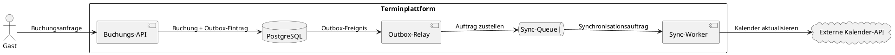
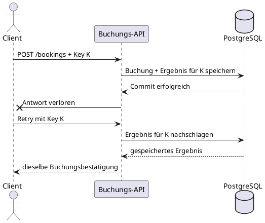
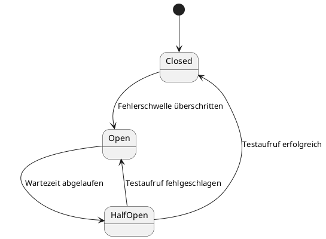
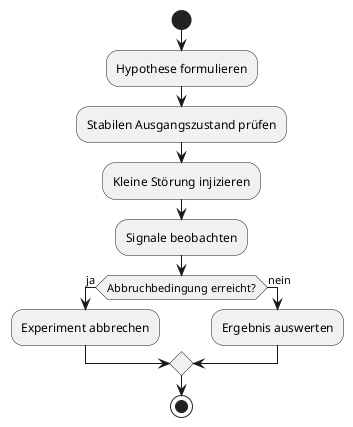

---
title: "Skalierbare Systeme - Resilienz, Fehlertoleranz & Hochverfügbarkeit"
topic: "scalable_systems_1_4"
author: "Lukas Panni"
theme: "metropolis"
fonttheme: "structurebold"
fontsize: 12pt
urlcolor: BrickRed
linkcolor: BrickRed
aspectratio: 169
lang: de-DE
numbersections: true
plantuml-format: svg
toc: true
section-titles: true
...

<!--
Time plan: 175 min teaching time; 15-minute break on top.
  Einstieg und Szenario                         8
  Zuverlässigkeit messbar machen              32
  Fehlerkaskaden und Stabilitätsmuster         43
  Hochverfügbarkeit und Recovery               42
  Resilienz testen und Incident Tabletop       25
  AI Engineering                               15
  Zusammenfassung und Transfer                 10
  Sum                                          175
-->

# Einstieg: Wenn Abhängigkeiten ausfallen

## Heute

- Zuverlässigkeit aus Nutzersicht messbar machen
- Fehler begrenzen, bevor sie zur Kaskade werden
- Hochverfügbarkeit und Recovery entwerfen
- Resilienz praktisch testen und aus Vorfällen lernen
- AI Engineering: KI-Komponenten als unzuverlässige Abhängigkeiten

## Lernziele

- Reliability, Availability, Fehlertoleranz und Resilienz unterscheiden
- ein einfaches SLI und SLO für einen Anwendungsfall formulieren
- typische Fehlerkaskaden erkennen und passende Stabilitätsmuster kombinieren
- Redundanz, Replikation und Backup voneinander abgrenzen
- ein Ausfallszenario strukturiert bewerten und eine Schutzmaßnahme begründen

## Rückblick: Terminbuchung als verteiltes System

- Organisationen sind Mandanten; der Tenant Context schützt ihre Daten
- PostgreSQL ist das System of Record für Buchungen (Bezug Vorlesung 2)
- Externe Kalender, E-Mail und Webhooks liegen außerhalb lokaler Transaktionen
- Queues entkoppeln nachgelagerte Arbeit; Zustellung kann Duplikate erzeugen

## Unser Szenario

- Eine Buchungsseite erhält ungewöhnlich viele Anfragen
- PostgreSQL und die Buchungs-App sind erreichbar
- Die externe Kalender-API antwortet immer langsamer
- Clients wiederholen fehlgeschlagene Requests
- Die Sync-Queue wächst; ein Mandant erzeugt besonders viel Last

Leitfrage:

- Wie bleibt die Buchung nutzbar, ohne Daten zu verlieren oder andere Mandanten mitzuziehen?

## Der Buchungsfluss und seine Fehlergrenzen



- Kernfunktion: Buchung verbindlich lokal speichern
- Nachgelagerte Funktion: Kalender synchronisieren und E-Mail versenden
- Die Architektur entscheidet, ob ein Ausfall optionaler Pfade den Kern stoppt

# Einheit 1 – Zuverlässigkeit messbar machen

## Fehler sind normal

- Prozesse stürzen ab; Netzwerke verlieren Pakete
- Abhängigkeiten werden langsam oder nicht erreichbar
- Verbindungspools und Queues laufen voll
- Konfigurationen oder Releases führen neue Fehler ein
- Gemeinsame Fehlerursachen (Zone, Deployment, Bug) überwinden naive Redundanz
- Last übersteigt zeitweise die verfügbare Kapazität

Architekturziel:

- nicht jeden Fehler verhindern, sondern Auswirkungen kontrollieren

## Reliability, Availability und Resilienz

| Begriff | Leitfrage |
|---|---|
| **Reliability** | Erfüllt das System seine Funktion über einen Zeitraum korrekt? |
| **Availability** | Ist der Dienst zum benötigten Zeitpunkt nutzbar? |
| **Fault Tolerance** | Arbeitet das System trotz bestimmter Fehler weiter? |
| **Resilience** | Begrenzt das System Auswirkungen und erholt sich? |
| **High Availability** | Welche Architektur reduziert ungeplante Nichtverfügbarkeit? |

Die Begriffe hängen zusammen, beschreiben aber unterschiedliche Eigenschaften.

## Fault, Error, Failure

- **Fault:** Ursache oder Defekt
- **Error:** fehlerhafter interner Zustand
- **Failure:** von außen sichtbare Abweichung

Beispiel Kalender-Synchronisation:

- Fault: Kalender-API antwortet nicht
- Error: Synchronisationsauftrag bleibt unbearbeitet
- Failure: Buchung wird fälschlich abgelehnt, obwohl sie lokal möglich wäre

Resiliente Reaktion: Buchung speichern, Synchronisation später nachholen.

## Partielle Fehler und Latenz

- Ein Teil des Systems funktioniert, ein anderer ist langsam oder ausgefallen
- Es ist oft unklar, ob eine entfernte Komponente defekt oder nur langsam ist
- Eine Antwort nach 30 Sekunden kann technisch erfolgreich, für Nutzer aber unbrauchbar sein
- Wartende Requests belegen Threads, Verbindungen und Speicher

Folgerung: Auch Erfolg braucht eine Zeitgrenze.

## SLI, SLO und SLA

- **SLI (Service Level Indicator):** gemessene Größe aus Nutzersicht
- **SLO (Service Level Objective):** Zielwert für ein SLI in einem Zeitfenster
- **SLA (Service Level Agreement):** vertragliche Vereinbarung mit möglichen Konsequenzen

Beispiel Buchungsservice:

- SLI: Anteil gültiger Buchungen, die erfolgreich bestätigt werden
- SLO: 99,5 % erfolgreicher Buchungen innerhalb von 30 Tagen
- SLA: vereinbarte Verfügbarkeit und Folgen bei Nichterfüllung

## Ein gutes SLI braucht klare Ereignisse

- Nenner: gültige Buchungsanfragen, die der Dienst tatsächlich bearbeiten soll
- Gutes Ereignis: Buchung innerhalb des vereinbarten Zeitlimits bestätigt
- Ungutes Ereignis: Fehler oder Antwort nach Ablauf des Zeitlimits
- Ungültige Eingaben gehören nicht in den Nenner eines Verfügbarkeits-SLI
- Slot-Suche und Buchung getrennt messen: Nutzer erleben verschiedene Funktionen

## Error Budget konkret berechnen

- SLO: 99,5 % erfolgreiche Buchungen in einem rollierenden 30-Tage-Fenster
- 100.000 gültige Anfragen → höchstens 500 dürfen fehlschlagen oder zu spät sein
- 650 schlechte Ereignisse → SLI 99,35 %, Budget um 150 Ereignisse überschritten
- Verspätete Kalender-Synchronisation zählt nur beim Sync-SLI als Fehler
- Fehlerbudget ist ein Steuerungssignal, keine Erlaubnis, Fehler absichtlich zu erzeugen

## Think–Pair–Share: ein brauchbares SLO

**Arbeitszeit: 6 Minuten — 2 allein, 2 zu zweit, 2 im Plenum**

Für die Slot-Suche und Kalender-Synchronisation:

1. Welche Messgröße bildet die Nutzererfahrung ab?
2. Welches Zeitfenster und welcher Zielwert wären sinnvoll?
3. Muss ein verspätetes Kalender-Update die Buchung als fehlgeschlagen zählen?

Ergebnis: je Funktion ein SLI und ein begründeter Zielwert.

## Error Budget und Verfügbarkeit

- Error Budget = tolerierte Abweichung vom SLO
- Bei 99,5 % erfolgreicher Buchungen dürfen 0,5 % fehlschlagen
- Ist das Budget aufgebraucht, können Stabilisierung und Ursachenbehebung Vorrang erhalten

| Verfügbarkeit | Ausfallzeit pro Jahr, ungefähr |
|---:|---:|
| 99 % | 3,65 Tage |
| 99,9 % | 8,76 Stunden |
| 99,99 % | 52,6 Minuten |

Jede zusätzliche Neun wird deutlich teurer.

# Einheit 2 – Fehlerkaskaden verhindern

## Vom langsamen Kalender zur Kaskade

1. Kalender-API wird langsam
2. Requests warten und belegen Verbindungen
3. Verbindungspool der App läuft voll
4. Clients und Worker wiederholen Aufrufe
5. Last steigt weiter, Queue wächst
6. Die Buchungs-API wird ebenfalls unbenutzbar

Eine Störung breitet sich über Abhängigkeiten aus: ein **kaskadierender Fehler**.
Bleibt ein überlastetes System auch nach Ende des Auslösers instabil, spricht man von einem metastabilen Ausfall.

## Think–Pair–Share: Wo zuerst eingreifen?

**Arbeitszeit: 5 Minuten — 1 allein, 2 zu zweit, 2 im Plenum**

Im Kalender-Szenario:

1. Welche Ressource wird zuerst knapp?
2. Welche Maßnahme schützt die lokale Buchung am wirksamsten?
3. Was sollte für den Nutzer weiterhin funktionieren?

## Timeouts und Deadlines

- Jeder Netzwerkaufruf braucht ein begrenztes Zeitbudget
- Timeout gibt Ressourcen frei und macht Fehler sichtbar
- Deadline begrenzt die Gesamtdauer eines Requests
- Unteraufrufe erhalten nur die verbleibende Zeit
- Ein Timeout löst noch nicht die fachliche Folge des Fehlers

Beispiel:

- Request insgesamt: 2 s; Datenbank höchstens 500 ms; Kalenderprüfung höchstens 800 ms

## Retries, Backoff und Jitter

- Retry hilft bei kurzzeitigem Netzwerkfehler oder temporärer Überlastung
- Kein Retry bei Validierungsfehlern oder dauerhaftem Ausfall
- Backoff vergrößert den Abstand zwischen Versuchen
- Jitter variiert Wartezeiten, damit Clients nicht synchron erneut anfragen
- Versuche und Gesamtdauer immer begrenzen

```text
100 ms → 220 ms → 470 ms → Abbruch
```

## Idempotenz macht Wiederholung sicher

- Wiederholung derselben Operation erzeugt keine zusätzliche Wirkung
- `GET /slots` ist typischerweise idempotent
- `POST /bookings` kann ohne Zusatzmechanismus doppelt buchen
- Bei Timeout ist unklar, ob die erste Buchung schon gespeichert wurde

Idempotency Key:

```http
POST /bookings
Idempotency-Key: 018f-example
```

- Schlüssel und Ergebnis speichern; Wiederholung liefert dasselbe Ergebnis zurück

## Timeout: Ergebnis unbekannt, nicht unbedingt fehlgeschlagen

- Server speichert die Buchung erfolgreich
- Antwort geht auf dem Rückweg verloren oder kommt nach der Client-Deadline
- Client sieht Timeout und kann nicht wissen, ob die Buchung existiert
- Neuer Key könnte eine zweite Buchung erzeugen
- Derselbe Idempotency Key erlaubt dem Server, das erste Ergebnis zurückzugeben



## Idempotency Key korrekt absichern

- Eindeutigkeit scoped setzen, z. B. `(tenant_id, operation, key)`
- Key, Buchung und wiederverwendbares Ergebnis atomar persistieren
- Eindeutigkeits-Constraint schützt auch bei gleichzeitigen Retries
- Gleicher Key mit anderem Request-Inhalt: Konflikt zurückgeben, nicht umdeuten
- Aufbewahrungsdauer muss länger als das mögliche Retry-Fenster sein
- Externe Kalenderwirkung bleibt separat: Outbox plus idempotenter Worker

## Circuit Breaker

- **Closed:** Aufrufe sind erlaubt; Fehler werden beobachtet
- **Open:** Aufrufe werden sofort abgelehnt, statt Ressourcen zu binden
- **Half-open:** einzelne Testaufrufe prüfen, ob die Abhängigkeit zurück ist
- Schützt den aufrufenden Dienst und gibt der Abhängigkeit Erholungszeit



## Bulkheads, Backpressure und Lastbegrenzung

- **Bulkhead:** Ressourcen nach Abhängigkeit oder Funktion trennen
- Beispiel: eigener Worker-Pool und begrenzte Queue für Kalender-Webhooks
- **Backpressure:** begrenzte Verarbeitungskapazität an den Erzeuger zurückmelden
- **Load Shedding:** weniger wichtige Arbeit kontrolliert ablehnen oder pausieren
- Rate Limits und Quotas pro Mandant begrenzen Noisy Neighbours (Bezug Vorlesung 2)

## Graceful Degradation und Entkopplung

- Kernfunktion erhalten, Komfortfunktion vorübergehend reduzieren
- Bei Kalenderausfall: Buchung lokal speichern und Sync als ausstehend markieren
- Queue entkoppelt den Request-Pfad; Größenlimit begrenzt Wachstum, DLQ isoliert dauerhaft fehlerhafte Nachrichten
- Outbox speichert Buchungsänderung und Ereignis atomar (Bezug Vorlesung 2)
- Duplikate bleiben möglich: Empfänger verarbeitet idempotent

## Stabilitätsmuster zusammenspielen lassen

Für die externe Kalender-API:

1. Gesamte Deadline und einzelner Timeout
2. wenige Retries mit Backoff und Jitter
3. Idempotenz für wiederholbare Schreiboperationen
4. Circuit Breaker und begrenzte Queue
5. eigener Worker-Pool und Quota pro Mandant
6. sichtbarer Status für fehlgeschlagene Synchronisationen

Nicht jedes Muster gehört in jedes System; entscheidend sind Fehlerbild und Kosten.

# Einheit 3 – Hochverfügbarkeit und Recovery

## Vom kritischen Pfad zum Single Point of Failure

- Ein Single Point of Failure kann den gesamten Dienst stoppen
- Kritischen Nutzerpfad identifizieren, nicht nur einzelne Komponenten zählen
- Beispiele: einzelne App-Instanz, Datenbank ohne Wiederherstellungsplan, Load Balancer ohne Ersatz
- Auch DNS, Secrets, Netz und Deployment können kritisch sein

## Think–Pair–Share: Failure Domains

**Arbeitszeit: 5 Minuten — 1 allein, 2 zu zweit, 2 im Plenum**

Zwei App-Instanzen stehen im selben Rechenzentrum und nutzen denselben Load Balancer.

1. Gegen welche Ausfälle helfen zwei Instanzen?
2. Welche gemeinsame Ausfälle bleiben möglich?
3. Wie würde eine zusätzliche Failure Domain aussehen?

## Redundanz und Failover

- Redundanz: kritische Komponenten mehrfach bereitstellen
- Failure Domains: Prozess, Host, Rack, Availability Zone, Region
- Redundanz hilft nur, wenn Replikate nicht dieselbe Fehlerursache teilen
- Failover benötigt Erkennung, eine Umschaltregel und gegebenenfalls Datenabgleich
- Active-Active kann Konflikte schaffen; Active-Passive benötigt Umschaltzeit
- Heartbeats und Timeouts schätzen Ausfälle; Leader Election und Quorum begrenzen Split Brain
- Konsensprotokolle wie Raft koordinieren Leader und Zustand, erzeugen aber selbst keine Verfügbarkeit

## Hochverfügbarkeit für zustandslose Services

- Mehrere App-Instanzen hinter einem Load Balancer
- Instanzen enthalten keinen wichtigen, nur lokal gespeicherten Zustand
- Sessions sind geteilt oder signiert; Dateien liegen nicht nur auf lokaler Platte
- **Liveness:** Prozess muss laufen; bei Fehler ggf. neu starten
- **Readiness:** Instanz kann Traffic annehmen; sonst aus Rotation nehmen
- Optionale Abhängigkeiten nicht blind in Readiness einbeziehen

```plantuml
@startuml
left to right direction
cloud "Clients" as Client
[Load Balancer] as LB
rectangle "Failure Domain A" { [App 1] as App1 }
rectangle "Failure Domain B" { [App 2] as App2 }
database "PostgreSQL Primary" as DB
Client --> LB
LB --> App1
LB --> App2
App1 --> DB
App2 --> DB
@enduml
```

## Datenbank-Replikation: Verfügbarkeit mit Nebenwirkungen

- Primary verarbeitet Writes; Replica kann Reads bedienen oder auf Failover warten
- Replikationsverzögerung kann einen gerade geschriebenen Datensatz unsichtbar machen
- Failover-Entscheidung, möglicher Datenverlust und Betrieb werden komplexer
- Kritische Reads nach einem Write gegebenenfalls an den Primary richten
- Mehr Replikate sind keine automatische Garantie für Hochverfügbarkeit

## Backup ist keine Replikation

| Replikation | Backup |
|---|---|
| hält Kopien auf aktuellem Stand | bewahrt historische Wiederherstellungspunkte |
| hilft bei Ausfall einer Instanz | hilft bei Löschung oder Beschädigung |
| kann Fehler sofort mitkopieren | erlaubt Rückkehr zu früherem Datenstand |

- Beides kann nötig sein; Restore muss regelmäßig getestet werden

## Recovery-Ziele an einem Vorfall prüfen

- 10:00 letztes erfolgreiches Backup; 10:20 Buchungen bestätigt; 10:25 Datenbankausfall
- Restore nur aus dem Backup: bis zu 25 Minuten bestätigte Buchungen fehlen
- Asynchrone Replica mit 2 Minuten Lag: möglicher Verlust etwa der letzten 2 Minuten
- Synchrone Replica kann den Datenverlust senken, bindet Writes aber an die Replica-Latenz
- Welche Strategie genügt, entscheidet das fachliche RPO — nicht der Produktname

## Recovery-Pfad und RTO

1. Ausfall erkennen und Primary als nicht verfügbar bewerten
2. Replica promoten oder Backup wiederherstellen
3. Verbindungen, Secrets und Schreibpfad umschalten
4. Integrität und Datenstand prüfen; Anwendung kontrolliert freigeben
- RTO umfasst Erkennung, Entscheidung, Umschaltung und Prüfung
- Regelmäßige Übung misst echte Dauer und deckt fehlende Schritte auf

## Failover oder Restore?

| Situation | Geeigneter erster Pfad | Zu prüfender Trade-off |
|---|---|---|
| Host ausgefallen, Daten intakt | Replica-Failover | Lag und mögliche Schreibverluste |
| Daten versehentlich gelöscht | Point-in-time Restore | RTO und Umfang verlorener Änderungen |
| Region verloren | Disaster-Recovery-Standby | Kosten, Umschaltung und Datenstand |
| Schadsoftware/Replikation von Schaden | isoliertes Backup | Wiederherstellung und saubere Umgebung |

Failover stellt den Dienst wieder bereit; Restore stellt einen früheren Datenstand wieder her.

## RTO und RPO bestimmen Recovery

- **RTO (Recovery Time Objective):** maximal akzeptable Wiederherstellungsdauer
- **RPO (Recovery Point Objective):** maximal akzeptabler Datenverlust
- Beispiel: RTO 60 Minuten, RPO 5 Minuten
- Restore-Zeit und wiederhergestellter Datenstand müssen die Ziele erfüllen
- Schlüssel, Konfiguration, Verantwortlichkeiten und Runbooks gehören zum Restore

## Disaster Recovery und Ende-zu-Ende-Verfügbarkeit

- Multi-Region: Backup-and-Restore, Pilot Light, Warm Standby oder Active-Active
- Je schneller die Übernahme, desto höher Kosten und Betriebsaufwand
- Verfügbarkeit ist Eigenschaft des gesamten kritischen Pfads
- Optionale Pfade wie Kalender, E-Mail und Analytics dürfen Buchungen nicht unnötig stoppen
- Einfaches, regelmäßig getestetes Recovery ist besser als ungetestetes Active-Active

# Einheit 4 – Resilienz testen und auf Vorfälle reagieren

## Resilienz ist keine Behauptung

- Automatisierte Tests prüfen Fehlerfälle neben dem Erfolgsfall
- Last-, Stress- und Soak-Tests zeigen unterschiedliche Grenzen
- Fault Injection prüft Verhalten unter kontrollierten Störungen
- Restore-Tests und Failover-Übungen prüfen Wiederherstellbarkeit
- Game Days und Incident Reviews machen Abläufe lernbar

## Lasttests und Fehler-Injektion

- **Lasttest:** erwartete Last; **Stresstest:** Last bis zur Grenze
- **Soak-Test:** Last über längere Zeit
- Beobachten: Erfolgsrate, p95-Latenz, Ressourcen, Queue-Länge und Datenkorrektheit
- Fehler injizieren: zusätzliche Latenz, Paketverlust, Verbindungsabbruch, knapper Pool
- Scope und Abbruchbedingung vor jedem Experiment festlegen

## Chaos Engineering als überprüfbares Experiment

- Hypothese: „Buchungen bleiben möglich, wenn die Kalender-API fünf Minuten ausfällt.“
- stabilen Ausgangszustand und messbare Signale festlegen
- kleine Störung mit begrenztem Blast Radius injizieren
- Verhalten beobachten; Experiment bei Gefahr abbrechen
- Ergebnis auswerten und konkrete Verbesserung ableiten



## Incident Tabletop: Kalender-API wird langsam

**Arbeitszeit: 12 Minuten — Dreiergruppen**

Situation: Die API benötigt 20 Sekunden; Buchungs-API wird langsamer, Queue wächst, Fehlerrate steigt.

1. Wählt eine sofortige Schutzmaßnahme.
2. Trennt Kernfunktion und optionale Funktion.
3. Legt zwei Messgrößen für die Wirkung fest.
4. Nennt eine dauerhafte Verbesserung.

Ergebnis: vier Stichpunkte, keine vollständige Architektur.

## Auswertung: Schutzwirkung sichtbar machen

- Sofort: Kalenderaufruf aus Request-Pfad nehmen, Timeout und Retries begrenzen
- Circuit Breaker öffnen; Queue und Worker-Pool begrenzen
- Messgrößen: Buchungserfolgsrate, p95-Latenz, Queue-Alter, Fehlerquote
- Dauerhaft: Outbox/Idempotenz, Bulkhead und dokumentierte Wiederanlaufstrategie
- In Vorlesung 6: Telemetrie, Alerting und Incident-Betrieb vertiefen

## Incident Response und blameless Postmortem

1. Störung erkennen und Auswirkung bestimmen
2. Verantwortliche benennen und Schaden begrenzen
3. Dienst wiederherstellen; Ursachenanalyse nicht vor die Stabilisierung stellen
4. Zeitlinie, technische und organisatorische Faktoren dokumentieren
5. konkrete Maßnahmen mit Verantwortlichen nachverfolgen

Keine Schuldzuweisung: „menschlicher Fehler“ ist keine ausreichende Ursachenanalyse.

<!-- TODO: Öffentliches Postmortem für ein kurzes Lehrbeispiel auswählen; optional Ausschnitt zu Auslöser, Verstärker, Erkennung und Behebung ergänzen. -->

# AI Engineering – Resilienz für KI-Komponenten

## Modell-APIs sind unzuverlässige Abhängigkeiten

- Rate Limits (`429`), Ausfälle und stark schwankende Latenzen
- Modellversionen können abgekündigt oder verändert werden
- Timeouts müssen zur längeren, aber begrenzten Laufzeit passen
- Fallback-Modell oder anderer Provider nur, wenn fachlich und wirtschaftlich sinnvoll
- Kostenbudget begrenzt Retry-Schleifen und unerwartete Last

## Fehler ohne Exception

- Ungültiges Format, Halluzination oder Verweigerung kann technisch erfolgreiche Antwort sein
- Strukturierte Ausgaben validieren; Ergebnisqualität als eigenes Signal behandeln
- Wiederholung mit verändertem Prompt ist ein neuer Versuch, keine Garantie
- Menschliche Eskalation oder regelbasierter Fallback als Alternative vorsehen

## Graceful Degradation mit KI

- Kernsystem muss ohne optionales KI-Feature weiterlaufen
- Gecachte oder regelbasierte Antwort kann als Fallback dienen
- Feature Flags nach Modell und Funktion ermöglichen gezieltes Abschalten
- Nutzer transparent informieren, wenn das KI-Feature nicht verfügbar ist
- Menschliche Freigabe dort, wo eine falsche Ausgabe hohe Folgen hat

# Zusammenfassung und Transfer

## Durchgängiges Schutzkonzept

1. Nutzerziele über SLI und SLO messbar machen
2. Zeit- und Lastgrenzen setzen
3. Idempotenz und begrenzte Wiederholung nutzen
4. Abhängigkeiten und Ressourcen isolieren
5. Redundanz, Backup und Recovery passend zum Ziel wählen
6. Fehlerverhalten testen und aus Vorfällen lernen

## Takeaways

- Fehler und langsame Antworten müssen eingeplant werden
- Kaskaden entstehen, wenn Warten und Retries Ressourcen aufbrauchen
- Kernfunktion von optionalen Abhängigkeiten entkoppeln
- Redundanz ersetzt kein Backup; Backup ohne Restore-Test ist unbewiesen
- Resilienz zeigt sich im getesteten Verhalten unter Störungen

## Nächste Vorlesung

- Architekturstile (Silas)
- Wie schneiden und koppeln wir Systeme, damit Änderungen und Ausfälle begrenzt bleiben?

# Literatur und Quellen

## Literaturhinweise

- Nygard: *Release It!*, 2. Auflage — Stabilitätsmuster und Antipatterns
- Beyer et al.: *Site Reliability Engineering* — SLOs, Fehlerbudgets, Überlast
- Kleppmann, Riccomini: *Designing Data-Intensive Applications*, 2. Auflage — Replikation und verteilte Systeme
- Google: *Building Secure and Reliable Systems* — Resilienz und Recovery

## Frei verfügbare Quellen

- [Google SRE Book](https://sre.google/sre-book/table-of-contents/)
- [Google SRE Workbook](https://sre.google/workbook/table-of-contents/)
- [Building Secure and Reliable Systems](https://google.github.io/building-secure-and-reliable-systems/raw/toc.html)
- [Cal.com Webhooks](https://cal.com/docs/developing/guides/automation/webhooks)
