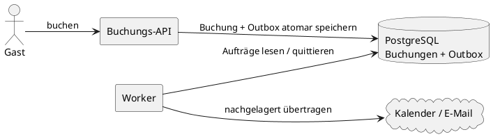
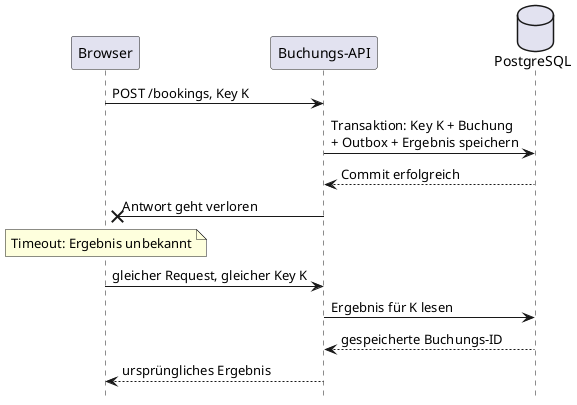
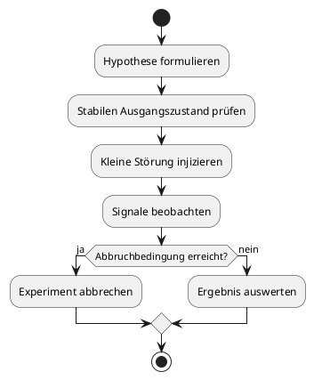

---
title: "Skalierbare Systeme - Resilienz, Fehlertoleranz & Hochverfügbarkeit"
topic: "scalable_systems_1_4"
author: "Lukas Panni"
theme: "metropolis"
fonttheme: "structurebold"
fontsize: 12pt
urlcolor: BrickRed
linkcolor: BrickRed
aspectratio: 169
lang: de-DE
numbersections: true
plantuml-format: svg
toc: true
section-titles: true
...

# Einstieg: Wenn Abhängigkeiten ausfallen

## Heute

- Zuverlässigkeit aus Nutzersicht messen.
- Fehler begrenzen, bevor sie zur Kaskade werden.
- Hochverfügbarkeit und Recovery entwerfen.
- Resilienz praktisch testen und aus Vorfällen lernen.
- AI Engineering: KI-Komponenten als unzuverlässige Abhängigkeiten.
- Durchgängiges Beispiel: Cal.diy-Terminplattform aus Vorlesung 2.

## Lernziele

- Zuverlässigkeit, Verfügbarkeit, Fehlertoleranz und Resilienz unterscheiden.
- Ein SLI und SLO für einen Anwendungsfall formulieren.
- Fehlerkaskaden erkennen und passende Stabilitätsmuster kombinieren.
- Redundanz, Replikation und Backup voneinander abgrenzen.
- Ein Ausfallszenario bewerten und eine Schutzmaßnahme begründen.

## Unser Szenario: Cal.diy unter Störungen

- Die Buchungsseite erhält ungewöhnlich viele Anfragen
- PostgreSQL und die Buchungs-API sind erreichbar
- Die externe Kalender-API antwortet immer langsamer
- Clients wiederholen fehlgeschlagene Requests
- Die Synchronisationsaufträge sammeln sich; ein Mandant erzeugt besonders viel Last

Leitfrage: Wie bleibt die Buchung nutzbar, ohne Daten zu verlieren oder andere Mandanten mitzuziehen?

## Buchungsfluss und Fehlergrenzen

```plantuml
@startuml
left to right direction
actor Gast
rectangle "Buchungs-API" as API
database "PostgreSQL\nBuchungen + Outbox" as DB
rectangle Worker
cloud "Kalender / E-Mail" as External
Gast --> API : buchen
API --> DB : Buchung + Outbox atomar speichern
Worker --> DB : Aufträge lesen / quittieren
Worker --> External : nachgelagert übertragen
@enduml
```

- Buchung und Outbox-Eintrag werden gemeinsam gespeichert
- Buchungserfolg und externe Synchronisation sind getrennte Zustände
- Die Plattform verwaltet buchbare Slots verbindlich; externe Kalender werden nachgelagert synchronisiert

# Zuverlässigkeit messbar machen

## Fehler sind normal

- Prozesse stürzen ab; Netzwerke verlieren Pakete.
- Abhängigkeiten werden langsam oder sind nicht erreichbar.
- Verbindungspools und Queues laufen voll.
- Konfigurationen oder Releases führen neue Fehler ein.
- Gemeinsame Fehlerursachen wie Zone, Deployment oder Bug überwinden naive Redundanz.
- Last übersteigt zeitweise die verfügbare Kapazität.

Architekturziel: Nicht jeden Fehler verhindern, sondern seine Auswirkungen kontrollieren.

## Reliability, Availability und Resilienz

| Begriff | Leitfrage |
|---|---|
| **Reliability** | Erfüllt das System seine Funktion über einen Zeitraum korrekt? |
| **Availability** | Ist der Dienst zum benötigten Zeitpunkt nutzbar? |
| **Fault Tolerance** | Arbeitet das System trotz bestimmter Fehler weiter? |
| **Resilience** | Begrenzt das System Auswirkungen und erholt sich? |
| **High Availability** | Welche Architektur reduziert ungeplante Nichtverfügbarkeit? |

Die Begriffe hängen zusammen, beschreiben aber unterschiedliche Eigenschaften.

## Fault, Error, Failure

- **Fault:** Ursache oder Defekt, zum Beispiel ein Fehler in der Prüfung freier Termine.
- **Error:** fehlerhafter interner Zustand, zum Beispiel ein belegter Termin wird als frei geführt.
- **Failure:** von außen sichtbare Abweichung, zum Beispiel eine bestätigte Doppelbuchung.
- Ein Fault führt nicht zwangsläufig zu einem Failure; das System kann den Error erkennen und abfangen.

## Partielle Fehler und Latenz

- Ein Teil des Systems funktioniert, während eine andere Komponente langsam oder ausgefallen ist.
- Oft ist unklar, ob eine entfernte Komponente defekt oder nur langsam ist.
- Eine Antwort nach 30 Sekunden kann technisch erfolgreich, für den Nutzer aber unbrauchbar sein.
- Wartende Requests belegen Threads, Verbindungen und Speicher.

Folgerung: Auch erfolgreiche Aufrufe brauchen eine Zeitgrenze.

## Verfügbarkeit messen

- Eine Prozentzahl ist nur aussagekräftig, wenn Leistung und Messzeitraum festgelegt sind.
- **Zeitbasiert:** Anteil der Zeit, in der der Dienst die vereinbarte Funktion erfüllt.
- **Anfragebasiert:** Anteil erfolgreicher Anfragen; ein anderes SLI als Uptime in Minuten.
- Geplante Wartung zählt nur dann nicht als Ausfall, wenn die Messdefinition sie ausdrücklich ausschließt.

## Die Neunen in Zeit übersetzt

- Annahme: 365 Tage im Jahr, 24/7-Betrieb; geplante Wartung ist nicht ausgenommen.
- **99 %:** höchstens 3 Tage, 15 Stunden und 36 Minuten Ausfall pro Jahr.
- **99,9 %:** höchstens 8 Stunden und 46 Minuten Ausfall pro Jahr.
- **99,99 %:** höchstens 52 Minuten und 34 Sekunden Ausfall pro Jahr.
- **99,999 %:** höchstens 5 Minuten und 15 Sekunden Ausfall pro Jahr.
- Jede zusätzliche Neun erhöht den Aufwand deutlich.

## MTBF und MTTR

- **MTBF (Mean Time Between Failures):** durchschnittliche Betriebszeit zwischen zwei Ausfällen.
- Längere MTBF bedeutet, dass Ausfälle seltener auftreten; sie beschreibt nicht deren Dauer.
- **MTTR (Mean Time To Repair/Restore):** durchschnittliche Dauer bis zur Wiederherstellung.
- Messbeginn und -ende festlegen, zum Beispiel vom Beginn der Beeinträchtigung bis zur Wiederherstellung.
- Näherung für einen reparierbaren Dienst: Verfügbarkeit ≈ MTBF / (MTBF + MTTR).
- Bei MTBF 100 Stunden und MTTR 1 Stunde ergibt sich ungefähr 99,0 % Verfügbarkeit.

## SLI, SLO und SLA

- **SLI (Service Level Indicator):** gemessene Größe aus Nutzersicht.
- **SLO (Service Level Objective):** Zielwert für ein SLI in einem festgelegten Messfenster.
- **SLA (Service Level Agreement):** vertragliche Vereinbarung mit möglichen Konsequenzen.
- Ein internes SLO sollte ausreichend Puffer zum vertraglichen SLA lassen.
- Messgröße, Grundgesamtheit, Messfenster und Behandlung von Fehlern genau festlegen.

## Unser Buchungs-SLI: Was zählt als Erfolg?

- **Grundgesamtheit:** eindeutige, gültige Buchungsabsichten für einen zuvor als frei angezeigten Slot.
- Pro Idempotency Key wird nur eine Absicht gezählt; technische Retries zählen nicht erneut.
- Ungültige Eingaben, fehlende Berechtigung und Health Checks sind ausgeschlossen.
- **Gutes Ereignis:** Buchung dauerhaft gespeichert und Bestätigung innerhalb von 2 Sekunden zurückgegeben.
- Fehler, Timeout, verspätete oder fehlende Bestätigung zählen als schlecht.
- **Messfenster:** rollierende 28 Tage; mindestens 99,9 % der Buchungsabsichten sollen gut sein.

## Think–Pair–Share: ein brauchbares SLO

**Arbeitszeit: 6 Minuten — 2 allein, 2 zu zweit, 2 im Plenum.**

Für die Buchungsbestätigung:

1. Was zählt als gültige Anfrage und als Erfolg?
2. Welche Antwortfrist und welches Messfenster sind sinnvoll?
3. Gehört die Kalender-Synchronisation in dieses SLI oder braucht sie ein eigenes?

Ergebnis: ein begründetes SLI mit Zielwert; die Synchronisation wird als eigene Funktion abgegrenzt.

## Fehlerbudget berechnen

- Im 28-Tage-Fenster gibt es 50.000 eindeutige Buchungsabsichten: 49.960 gute und 40 schlechte.
- **SLI:** 49.960 / 50.000 = 99,92 %; **SLO:** 99,9 %.
- Fehlerbudget: höchstens 0,1 % × 50.000 = 50 schlechte Buchungen.
- Verbraucht sind 40 von 50 Ereignissen, also 80 %; zehn bleiben übrig.
- Das Budget zählt Nutzerereignisse, nicht Minuten; ein später Retry macht einen Fehler nicht rückwirkend gut.
- Fehlerbudgets helfen, Zuverlässigkeit und Änderungsfrequenz abzuwägen.

## Verfügbarkeit verketteter Komponenten

- Sind mehrere Komponenten für eine Anfrage zwingend nötig, müssen alle verfügbar sein.
- Bei unabhängigen Ausfällen multiplizieren sich die Verfügbarkeiten: API 99,9 % × Datenbank 99,9 % ≈ 99,80 %.
- Abhängigkeiten und gemeinsame Fehlerursachen machen die Unabhängigkeitsannahme oft unzutreffend.
- Redundanz kann Verfügbarkeit verbessern, beseitigt aber keine gemeinsamen Fehlerursachen.

## Warum verteilte Systeme scheitern

- Netzwerke verzögern oder verlieren Nachrichten; eine Antwort ist auch bei erfolgreicher Verarbeitung nicht garantiert.
- Uhren driften und sind nicht perfekt synchronisiert.
- Zeitstempel allein liefern keine sichere globale Reihenfolge.
- Teilausfälle sind normal: Ein Knoten kann unerreichbar sein, während der Rest weiterläuft.
- Ein Timeout zeigt nicht, ob der andere Knoten abgestürzt ist oder nur langsam antwortet.

## Fallacies of Distributed Computing (1/2)

Peter Deutschs Annahmen, die beim Entwurf verteilter Systeme oft falsch sind:

- **The network is reliable:** Pakete können verloren gehen und Verbindungen abbrechen.
- **Latency is zero:** Antworten brauchen Zeit; Timeouts sind nur Grenzwerte.
- **Bandwidth is infinite:** Konkurrenz und Last begrenzen den Durchsatz.
- **The network is secure:** Angriffe und Fehlkonfigurationen sind möglich.

## Fallacies of Distributed Computing (2/2)

- **Topology doesn't change:** Knoten, Routen und Adressen können wechseln.
- **There is one administrator:** Systeme und Regeln liegen oft in verschiedenen Zuständigkeiten.
- **Transport cost is zero:** Übertragung braucht Zeit und Ressourcen.
- **The network is homogeneous:** Protokolle, Systeme und Geräte unterscheiden sich.

## Ausfallarten

- **Crash:** Eine Komponente stoppt.
- **Omission:** Nachrichten werden nicht gesendet oder empfangen.
- **Timing:** Antworten kommen zu spät oder außerhalb vereinbarter Grenzen.
- **Byzantine:** Eine Komponente verhält sich beliebig oder widersprüchlich.
- **Korrelierte, kaskadierende und metastabile Ausfälle** können lokale Fehler verstärken.

# Fehlerkaskaden verhindern

## Vom langsamen Kalender zur Kaskade

1. Die Kalender-API wird langsam.
2. Requests warten und belegen Verbindungen.
3. Der Verbindungspool der Anwendung läuft voll.
4. Clients und Worker wiederholen Aufrufe.
5. Last und Queue-Rückstand wachsen.
6. Schließlich wird auch die Buchungs-API unbenutzbar.

Bleibt ein überlastetes System auch nach Ende des Auslösers instabil, spricht man von einem metastabilen Ausfall.

## Think–Pair–Share: Wo zuerst eingreifen?

**Arbeitszeit: 5 Minuten — 1 allein, 2 zu zweit, 2 im Plenum.**

Im Kalender-Szenario:

1. Welche Ressource wird zuerst knapp?
2. Welche Schutzmaßnahme würdet ihr zuerst einsetzen?
3. Was sollte für den Nutzer weiterhin funktionieren?

Ergebnis: eine erste Maßnahme mit kurzer Begründung.

## Timeouts und Deadlines

- Jeder Netzwerkaufruf braucht ein begrenztes Zeitbudget.
- Ein Timeout begrenzt das Warten, sagt aber nicht, ob die Operation ausgeführt wurde.
- Eine Deadline begrenzt die Gesamtdauer des Requests.
- Unteraufrufe erhalten nur die verbleibende Zeit.
- Abbruch und Deadline müssen bis zur Arbeit weitergereicht werden, damit Ressourcen frei werden.
- Ein Abbruch macht bereits gespeicherte Buchungen nicht rückgängig.

## Cal.diy: Timeout heißt Ergebnis unbekannt

- Die Datenbank bestätigt den Commit, aber die Antwort erreicht den Gast nicht.
- Nach Ablauf des Timeouts zeigt der Browser einen unklaren Status.
- **Timeout bedeutet: Ergebnis unbekannt, nicht: Operation nicht ausgeführt.**
- Ein erneuter Request kann die fachliche Aktion nochmals auslösen.

## Cal.diy: Verlorene Antwort und sicherer Retry

```plantuml
@startuml
hide footbox
participant Browser
participant "Buchungs-API" as API
database PostgreSQL as DB
Browser -> API : POST /bookings, Key K
API -> DB : Transaktion: Key K + Buchung\n+ Outbox + Ergebnis speichern
DB --> API : Commit erfolgreich
API ->x Browser : Antwort geht verloren
note over Browser : Timeout: Ergebnis unbekannt
Browser -> API : gleicher Request, gleicher Key K
API -> DB : Ergebnis für K lesen
DB --> API : gespeicherte Buchungs-ID
API --> Browser : ursprüngliches Ergebnis
@enduml
```

## Timeouts: ein Zeitbudget für den gesamten Request

- Für die interaktive Buchung stehen insgesamt 2 Sekunden zur Verfügung.
- Aufrufe und Wiederholungen teilen dieses Budget; nicht jeder Versuch bekommt neue 2 Sekunden.
- Verbindungsaufbau und Antwortzeit in das Zeitbudget einbeziehen.
- Verbleibende Deadline an nachgelagerte Dienste weitergeben.
- Zu kurze Timeouts erzeugen unnötige Wiederholungen; zu lange binden Ressourcen.

## Retries, Backoff und Jitter

- Nur geeignete, vorübergehende Fehler wiederholen, zum Beispiel Verbindungsfehler oder HTTP 503.
- Ungültige Eingaben oder einen belegten Slot nicht unverändert erneut senden.
- Bei HTTP 429 `Retry-After` berücksichtigen, sofern vorhanden.
- **Exponential Backoff:** Wartezeit zwischen Versuchen vergrößern und begrenzen.
- **Jitter:** Wartezeiten zufällig streuen, damit Clients nicht gleichzeitig erneut anfragen.
- Versuchszahl und Gesamtdeadline begrenzen; ohne Restbudget abbrechen.
- Schreiboperationen nur wiederholen, wenn ihre Wirkung gegen Duplikate abgesichert ist.

## Idempotenz macht Wiederholung sicher

- Idempotent: Mehrfaches Ausführen hat dieselbe beabsichtigte Wirkung wie einmaliges Ausführen.
- „Buchung auf storniert setzen“ kann natürlich idempotent sein; „neue Buchung anlegen“ ist es nicht.
- Der Client erzeugt einen Idempotency Key pro Buchungsabsicht und behält ihn bei Retries bei.
- Die API ordnet dem Schlüssel das ursprüngliche Ergebnis zu und liefert es erneut.
- Eine neue Buchungsabsicht erhält einen neuen Schlüssel.
- Ein Unique Constraint für den Slot bleibt nötig: Zwei Absichten dürfen ihn nicht doppelt belegen (Bezug Vorlesung 2).

## Idempotency Keys korrekt absichern

- Schlüssel an Mandant und Operation binden; Berechtigungen bei jedem Request prüfen.
- Request-Inhalt vergleichen; gleicher Schlüssel mit anderem Inhalt wird abgelehnt.
- Schlüssel, Buchung, Outbox-Eintrag und Ergebnis atomar speichern.
- Eindeutiger Schlüssel und Transaktionslogik koordinieren gleichzeitige Wiederholungen.
- Solange der erste Request läuft, begrenzt warten oder „noch in Bearbeitung“ zurückgeben.
- Aufbewahrungsdauer festlegen; nach Ablauf ist ein alter Retry nicht mehr zuverlässig deduplizierbar.

## Cal.diy: Wenn Retries den Kalenderausfall verstärken

- Der Kalenderdienst wird langsam; der Worker wiederholt die Übertragung.
- Worker, HTTP-Client und Proxy versuchen jeweils bis zu dreimal, inklusive Erstversuch.
- Im schlechtesten Fall entstehen 3³ = 27 Kalenderaufrufe für einen Auftrag.
- Zusätzliche Last verzögert Antworten weiter und löst noch mehr Timeouts aus.
- Retries an einer verantwortlichen Stelle bündeln und zusätzliche Versuche begrenzen.
- Kalenderaufrufe separat limitieren, Backoff mit Jitter nutzen und Aufträge später erneut versuchen.

## Circuit Breaker

- **Closed:** Aufrufe passieren; Fehlerquote oder Timeout-Schwellwert öffnet den Breaker.
- **Open:** Aufrufe werden sofort abgewiesen oder auf einen Fallback gelenkt.
- Nach einer Abkühlzeit lässt **half-open** nur wenige Probeaufrufe zu.
- Probe erfolgreich: zurück zu closed; Probe scheitert: zurück zu open.
- Der Breaker ersetzt weder Timeouts noch Retry-Limits.
- Cal.diy: Kalenderaufrufe pausieren; Buchungen bleiben gespeichert und Synchronisationen ausstehend.

## Bulkheads, Backpressure und Lastbegrenzung

- **Bulkhead:** getrennte Ressourcen halten Fehler und Rückstau innerhalb einer Abhängigkeit.
- Cal.diy: Ein eigener Worker-Pool für Kalenderaufrufe verhindert, dass langsame Kalender E-Mails blockieren.
- **Backpressure:** Verarbeitungskapazität an den Erzeuger zurückmelden.
- **Load Shedding:** weniger wichtige Arbeit kontrolliert ablehnen oder pausieren.
- Rate Limits und Quotas pro Mandant begrenzen Noisy Neighbours (Bezug Vorlesung 2).
- Isolation begrenzt die Ausbreitung eines Ausfalls, verhindert ihn aber nicht.

## Graceful Degradation und Entkopplung

- Kernfunktion erhalten und Komfortfunktion vorübergehend reduzieren.
- Bei Kalenderausfall: Buchung lokal speichern und Synchronisation als ausstehend markieren.
- Queue entkoppelt den Request-Pfad; Größenlimit begrenzt Wachstum.
- Outbox speichert Buchungsänderung und Ereignis atomar (Bezug Vorlesung 2).
- Dead Letter Queue isoliert dauerhaft fehlerhafte Nachrichten.
- Duplikate bleiben möglich; externe Effekte brauchen stabile Auftrags-IDs und Deduplizierung, soweit die API das unterstützt.
- Buchbare Slots müssen intern verbindlich verwaltet sein, bevor eine Buchung bestätigt wird.

## Stabilitätsmuster zusammenspielen lassen

Für die externe Kalender-API:

1. Gesamte Deadline und einzelne Timeouts setzen.
2. Wenige Retries mit Backoff und Jitter zulassen.
3. Wiederholbare Schreiboperationen idempotent machen.
4. Circuit Breaker und begrenzte Queue einsetzen.
5. Worker-Pool und Quota pro Mandant isolieren.
6. Status fehlgeschlagener Synchronisationen sichtbar machen.

Nicht jedes Muster gehört in jedes System; entscheidend sind Fehlerbild und Kosten.

# Hochverfügbarkeit und Recovery

## Vom kritischen Pfad zum Single Point of Failure

- Ein Single Point of Failure kann den gesamten Dienst stoppen.
- Den kritischen Nutzerpfad identifizieren, nicht nur einzelne Komponenten zählen.
- Beispiele: einzelne App-Instanz, Datenbank ohne Recovery-Plan oder Load Balancer ohne Ersatz.
- Auch DNS, Secrets, Netzwerk und Deployment können kritisch sein.

## Think–Pair–Share: Failure Domains

**Arbeitszeit: 5 Minuten — 1 allein, 2 zu zweit, 2 im Plenum.**

Zwei App-Instanzen stehen im selben Rechenzentrum und nutzen denselben Load Balancer:

1. Gegen welche Ausfälle helfen die zwei Instanzen?
2. Welche gemeinsamen Ausfälle bleiben möglich?
3. Wie sähe eine zusätzliche Failure Domain aus?

Ergebnis: eine gemeinsame Fehlerursache und eine passende zusätzliche Failure Domain benennen.

## Redundanz und Kapazitätsreserve

- Redundanz über Prozesse, Hosts, Availability Zones und Regionen verteilen.
- Active-Active und Active-Passive haben unterschiedliche Umschalt- und Konsistenzkosten.
- Redundanz hilft nur, wenn Replikate keine gemeinsame Fehlerursache teilen.
- Zwei gleich große API-Instanzen bedienen jeweils 60 % ihrer Verarbeitungskapazität.
- Fällt eine aus, müsste die andere bei gleicher Last 120 % übernehmen.
- Reserve vorhalten und überschüssige Last gezielt ablehnen; Autoscaling wirkt nicht sofort.

## Failover und Konsens

- Ausfall erkennen: Heartbeats und Timeouts liefern nur Schätzungen.
- Leader Election, Split Brain und Quorum bestimmen, wer schreiben darf.
- Raft und Paxos koordinieren Konsens; sie erzeugen nicht automatisch Verfügbarkeit.
- etcd, ZooKeeper und Datenbank-Cluster nutzen Konsensverfahren.
- Sichere Schreibberechtigung ist Voraussetzung für Failover.

## Cal.diy: Failover kann Doppelbuchungen ermöglichen

- Der Datenbank-Leader ist vom Cluster getrennt, für einige API-Instanzen aber noch erreichbar.
- Die Mehrheitsseite wählt einen neuen Leader; der alte hält sich weiterhin für zuständig.
- Ohne Schreibschutz könnten beide Seiten denselben Slot bestätigen.
- Ein Unique Constraint schützt nur innerhalb der jeweiligen Datenbankhistorie.
- Ein Timeout beweist nicht, dass der alte Leader aufgehört hat zu schreiben.
- **Fencing:** Den alten Leader zuverlässig vom Schreiben ausschließen, etwa durch Entzug des Storage-Zugriffs.
- Eine unklare Seite muss Schreibzugriffe ablehnen.

## Hochverfügbarkeit für zustandslose Services

- Mehrere App-Instanzen hinter einem Load Balancer bereitstellen.
- Instanzen enthalten keinen wichtigen, nur lokal gespeicherten Zustand.
- Sessions sind geteilt oder signiert; Dateien liegen nicht nur auf lokaler Platte.
- **Liveness:** Erkennt einen festgefahrenen Prozess; bei Fehler kann ein Neustart helfen.
- **Readiness:** Nimmt nur bereite Instanzen in den regulären Traffic auf.
- Temporäre Kalender-Ausfälle nicht als Liveness-Fehler behandeln.

## Health Checks als Ausfallverstärker

- Die Datenbank ist kurz nicht erreichbar, die API-Prozesse selbst funktionieren.
- Prüft Liveness die Datenbank, werden alle API-Instanzen als defekt neu gestartet.
- Neue Verbindungen und Warm-up erzeugen Zusatzlast; der Datenbankfehler bleibt bestehen.
- Readiness nur an Abhängigkeiten ausrichten, die für den vorgesehenen Traffic notwendig sind.
- Ein ausgefallener Kalender darf die Buchungs-API des Lehrmodells nicht stilllegen.

## Datenbank-Replikation: Verfügbarkeit mit Nebenwirkungen

- Der Primary verarbeitet Writes; Replicas bedienen je nach Aufbau Reads oder warten auf Failover.
- Replikationsverzögerung kann einen gerade geschriebenen Datensatz unsichtbar machen.
- Failover-Entscheidung, möglicher Datenverlust und Betrieb werden komplexer.
- Kritische Reads nach einem Write gegebenenfalls an den Primary richten.
- Mehr Replicas sind keine automatische Garantie für Hochverfügbarkeit.

## Backup ist keine Replikation

| Replikation | Backup |
|---|---|
| Hält Kopien je nach Verfahren synchron oder verzögert aktuell. | Bewahrt historische Wiederherstellungspunkte. |
| Hilft beim Ausfall einer Instanz. | Hilft bei Löschung oder Beschädigung. |
| Kann Fehler sofort mitkopieren. | Erlaubt die Rückkehr zu einem früheren Datenstand. |

Beides kann nötig sein; Restore regelmäßig testen.

## RTO und RPO bestimmen Recovery

- **RTO (Recovery Time Objective):** maximal akzeptable Wiederherstellungsdauer.
- **RPO (Recovery Point Objective):** maximal akzeptabler Datenverlust.
- Beispiel: RTO 60 Minuten, RPO 5 Minuten.
- Restore-Zeit und wiederhergestellter Datenstand müssen die Ziele erfüllen.
- Schlüssel, Konfiguration, Verantwortlichkeiten und Runbooks gehören zum Restore.

## Recovery-Ziele an einem Vorfall prüfen

- 10:00 letztes erfolgreiches Backup; 10:20 Buchungen bestätigt; 10:25 Datenbankausfall.
- Restore nur aus dem Backup: Bis zu 25 Minuten bestätigte Buchungen fehlen.
- Asynchrone Replica mit 2 Minuten Lag: möglicher Verlust etwa der letzten 2 Minuten.
- Synchrone Replica kann Datenverlust senken, bindet Writes aber an die Replica-Latenz.
- Die fachlichen RPO-Ziele bestimmen die Strategie, nicht der Produktname.

## Recovery-Pfad und RTO

1. Ausfall erkennen und Primary als nicht verfügbar bewerten.
2. Replica promoten oder Backup wiederherstellen.
3. Verbindungen, Secrets und Schreibpfad umschalten.
4. Integrität und Datenstand prüfen; Anwendung kontrolliert freigeben.

Erkennung, Entscheidung, Umschaltung und Prüfung zählen vollständig zum RTO.

## Failover oder Restore?

| Situation | Erster möglicher Pfad | Zu prüfender Trade-off |
|---|---|---|
| Host ausgefallen, Daten intakt | Replica-Failover | Lag und mögliche Schreibverluste. |
| Daten versehentlich gelöscht | Point-in-time Restore | RTO und Umfang verlorener Änderungen. |
| Region verloren | Disaster-Recovery-Standby | Kosten, Umschaltung und Datenstand. |
| Schaden wird repliziert | Isoliertes Backup | Wiederherstellung und saubere Umgebung. |

Failover stellt den Dienst wieder bereit; Restore stellt einen früheren Datenstand wieder her.

## Disaster Recovery und Ende-zu-Ende-Verfügbarkeit

- Multi-Region: Backup-and-Restore, Pilot Light, Warm Standby oder Active-Active.
- Je schneller die Übernahme, desto höher Kosten und Betriebsaufwand.
- Verfügbarkeit ist Eigenschaft des gesamten kritischen Pfads.
- Optionale Pfade wie Kalender, E-Mail und Analytics dürfen Buchungen nicht unnötig stoppen.
- Einfaches, regelmäßig getestetes Recovery ist besser als ungetestetes Active-Active.

# Resilienz testen und aus Vorfällen lernen

## Resilienz ist keine Behauptung

- Automatisierte Tests prüfen Fehlerfälle neben dem Erfolgsfall.
- Last-, Stress- und Soak-Tests zeigen unterschiedliche Grenzen.
- Fault Injection prüft Verhalten unter kontrollierten Störungen.
- Restore-Tests und Failover-Übungen prüfen Wiederherstellbarkeit.
- Game Days und Incident Reviews machen Abläufe lernbar.

## Lasttests und Fehler-Injektion

- **Lasttest:** erwartete Last; **Stresstest:** Last bis zur Grenze.
- **Soak-Test:** Last über längere Zeit.
- Erfolgsrate, p95-Latenz, Ressourcen, Queue-Länge und Datenkorrektheit beobachten.
- Fehler injizieren: zusätzliche Latenz, Paketverlust, Verbindungsabbruch oder knapper Pool.
- Scope und Abbruchbedingung vor jedem Experiment festlegen.

## Chaos Engineering als überprüfbares Experiment

- Hypothese: „Buchungen bleiben möglich, wenn die Kalender-API fünf Minuten ausfällt.“
- Stabilen Ausgangszustand und messbare Signale festlegen.
- Kleine Störung mit begrenztem Blast Radius injizieren.
- Verhalten beobachten und Experiment bei Gefahr abbrechen.
- Ergebnis auswerten und konkrete Verbesserung ableiten.

```plantuml
@startuml
start
:Hypothese formulieren;
:Stabilen Ausgangszustand prüfen;
:Kleine Störung injizieren;
:Signale beobachten;
if (Abbruchbedingung erreicht?) then (ja)
  :Experiment abbrechen;
else (nein)
  :Ergebnis auswerten;
endif
stop
@enduml
```

## Aus Ausfällen lernen

- Incident Response: Auswirkung bestimmen, Verantwortliche benennen und Schaden begrenzen.
- Dienst wiederherstellen; Ursachenanalyse nicht vor die Stabilisierung stellen.
- Zeitlinie, technische und organisatorische Faktoren dokumentieren.
- Maßnahmen mit Verantwortlichen nachverfolgen.
- Blameless Post-Mortems vermeiden Schuldzuweisung; „menschlicher Fehler“ ist keine ausreichende Ursachenanalyse.
- Incident Management und Observability werden in Vorlesung 6 vertieft.

## Fallbeispiel: GitHub-Ausfall im Oktober 2018

- Wartungsarbeiten unterbrachen für 43 Sekunden die Verbindung zum primären US-Ostküsten-Rechenzentrum.
- Automatisches Failover machte die US-Westküste zur neuen Primary für mehrere Datenbankcluster.
- Nach Wiederherstellung der Verbindung hatten beide Regionen nicht replizierte Writes.
- Cross-Region-Latenz und inkonsistente Topologien beeinträchtigten Anwendungen weiter.
- GitHub meldete insgesamt 24 Stunden und 11 Minuten beeinträchtigten Betrieb.

## GitHub: Wiederherstellung und Lehren

- GitHub priorisierte Datenintegrität und stoppte teilweise schreibende Hintergrundjobs.
- Restore großer MySQL-Cluster aus Backups dauerte Stunden; Replikationslag verzögerte die Rückkehr zur stabilen Topologie.
- Nach Wiederanlauf warteten über fünf Millionen Webhook-Ereignisse und 80.000 Pages-Builds.
- Maßnahmen: regionsübergreifendes Failover begrenzen, Multi-Datacenter-Redundanz ausbauen und Fehlerannahmen gezielt testen.
- Quelle: [October 21 post-incident analysis](https://github.blog/news-insights/company-news/oct21-post-incident-analysis/) (GitHub, 2018).

## Beispiel: Cal.diy bei Kalenderausfall

- Die Kalender-API wird langsam; Buchungsanfragen und Synchronisationsaufträge treffen gleichzeitig ein.
- Im Plenum durchspielen: Welche Funktion bleibt verfügbar, was wird begrenzt und was wird später nachgeholt?
- Antwortverlust, Retry, Circuit Breaker und Queue-Rückstand in den Ablauf einbeziehen.
- Schutzwirkung an Buchungserfolgsrate, Antwortzeit und Alter der ältesten Synchronisation messen.

# AI Engineering – Resilienz für KI-Komponenten

## Modell-APIs sind unzuverlässige Abhängigkeiten

- Erweiterung des Cal.diy-Lehrmodells: Eine optionale KI formuliert Terminbeschreibungen.
- Rate Limits (HTTP 429), Ausfälle, Latenzschwankungen und Modell-Deprecation einplanen.
- Inferenz hat ein eigenes Zeit- und Tokenbudget; die interaktive Buchung wartet nicht auf die Modellantwort.
- Fallback-Modell oder manuelle Eingabe nur innerhalb definierter Latenz- und Kostenbudgets nutzen.
- Kostenbudgets und Circuit Breaker begrenzen Retry-Schleifen und schützen vor Provider-Ausfällen.

## KI-Retries: technisch oder inhaltlich?

- Vorübergehende Transportfehler und HTTP 429/5xx begrenzt wiederholen; `Retry-After` beachten.
- Gemeinsame Deadline sowie Versuch-, Token- und Kostenlimit setzen; keine Retry-Schichten stapeln.
- Timeout ist mehrdeutig: Der Provider kann die Generierung bereits ausgeführt und berechnet haben.
- Derselbe Prompt-Retry garantiert kein besseres Ergebnis.
- Ungültige strukturierte Ausgabe gezielt reparieren und erneut validieren.
- Halluzination oder Verweigerung nicht blind wiederholen; manuelle Eingabe oder menschliche Prüfung anbieten.
- Tool-Aufrufe mit Seiteneffekten brauchen Idempotency Keys, damit ein Modell-Retry keine zweite Buchung auslöst.

## Fehler ohne Exception

- Falsches Format, Halluzination oder Verweigerung können ohne technische Exception auftreten.
- Strukturierte Ausgaben validieren und Ergebnisqualität als eigenes Signal behandeln.
- Wiederholung mit verändertem Prompt ist ein neuer Versuch, keine Garantie.
- Menschliche Eskalation oder regelbasierter Fallback kann geeigneter sein.

## Graceful Degradation mit KI

- Das Kernsystem muss ohne optionales KI-Feature weiterlaufen.
- Gecachte oder regelbasierte Antworten können als Fallback dienen.
- Feature Flags pro Modell und Funktion ermöglichen gezieltes Abschalten.
- Cal.diy: Terminbeschreibung manuell eingeben statt generieren; die Buchung bleibt möglich.
- Nutzer transparent informieren, wenn das KI-Feature nicht verfügbar ist.

# Zusammenfassung und Transfer

## Durchgängiges Schutzkonzept

1. Nutzerziele über SLI und SLO messbar machen.
2. Zeit- und Lastgrenzen setzen.
3. Idempotenz und begrenzte Wiederholungen nutzen.
4. Abhängigkeiten und Ressourcen isolieren.
5. Redundanz, Backup und Recovery passend zum Ziel wählen.
6. Fehlerverhalten testen und aus Vorfällen lernen.

## Takeaways

- Fehler und langsame Antworten müssen eingeplant werden.
- Kaskaden entstehen, wenn Warten und Retries Ressourcen aufbrauchen.
- Kernfunktion von optionalen Abhängigkeiten entkoppeln.
- Redundanz ersetzt kein Backup; Backup ohne Restore-Test ist unbewiesen.
- Resilienz zeigt sich im getesteten Verhalten unter Störungen.

## Nächste Vorlesung

- Architekturstile (Silas).
- Wie schneiden und koppeln wir Systeme, damit Änderungen und Ausfälle begrenzt bleiben?

# Literatur und Quellen

## Literaturhinweise

- Nygard: *Release It!*, 2. Auflage — Stabilitätsmuster und Anti-Patterns.
- Beyer et al.: *Site Reliability Engineering* — SLOs, Fehlerbudgets und Überlast.
- Kleppmann, Riccomini: *Designing Data-Intensive Applications*, 2. Auflage — Replikation und verteilte Systeme.
- Google: *Building Secure and Reliable Systems* — Resilienz und Recovery.

## Frei verfügbare Quellen

- [Google SRE Book](https://sre.google/sre-book/table-of-contents/).
- [Google SRE Workbook](https://sre.google/workbook/table-of-contents/).
- [Building Secure and Reliable Systems](https://google.github.io/building-secure-and-reliable-systems/raw/toc.html).
- [Cal.com Webhooks](https://cal.com/docs/developing/guides/automation/webhooks).
