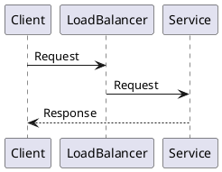

---
title: "Skalierbare Systeme - XXXX"
topic: "scalable_systems_1_X"
author: "Lukas Panni & Silas Schnurr"
theme: "metropolis"
fonttheme: "structurebold"
fontsize: 12pt
urlcolor: BrickRed
linkcolor: BrickRed
aspectratio: 169
lang: de-DE
numbersections: true
plantuml-format: svg
toc: true
section-titles: true
...

# Neuer Abschnitt

## Neue Folie

### Zwischenüberschrift

- Inhalt

<!-- Author notes go into HTML comments; pandoc drops them from the PDF. -->

## Folie mit Code

```typescript
const fib = (n: number): number => (n < 2 ? 1 : fib(n - 1) + fib(n - 2));
```

## Folie mit Diagramm


